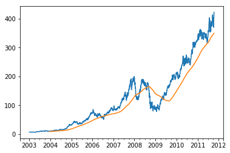
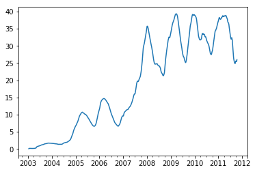
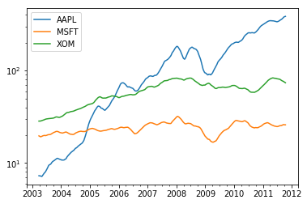
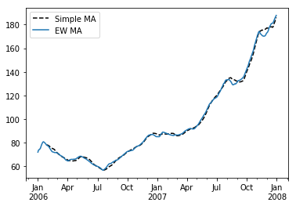
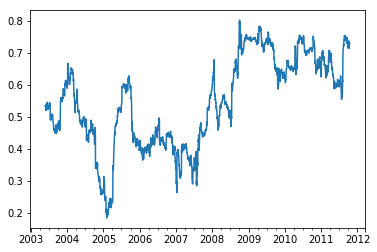
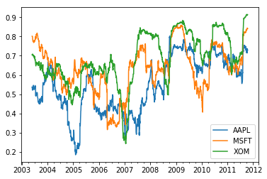
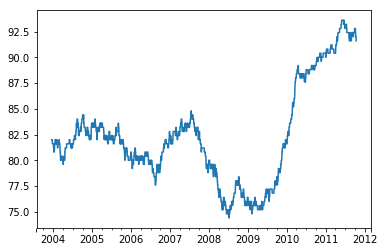

```python
import pandas as pd
```


```python
import numpy as np
```


```python
import pytz
```


```python
from datetime import datetime
```


```python
from datetime import timedelta
```


```python
from dateutil.parser import parse
```


```python
from pandas.tseries.offsets import Hour, Minute
```


```python
from pandas.tseries.offsets import Day, MonthEnd
```


```python
from pandas.tseries.offsets import Hour
```


```python
from matplotlib import pyplot as plt
```


```python
from scipy.stats import percentileofscore
```


```python
# 日期和时间数据类型及工具
```


```python
now = datetime.now()
```


```python
now
```


    datetime.datetime(2018, 7, 10, 10, 51, 5, 466135)


```python
delta = datetime(2011, 1, 7) - datetime(2008, 6, 24, 8, 15)
```


```python
delta
```


    datetime.timedelta(926, 56700)


```python
delta.days
```


    926


```python
delta.seconds
```


    56700


```python
start = datetime(2011, 1, 7)
```


```python
start - 2 * timedelta(12)
```


    datetime.datetime(2010, 12, 14, 0, 0)


```python
# date  以公历形式存储日历日期
# time  将时间存储为时, 分, 秒, 毫秒
# datetime  存储日期和时间
# timedelta  表示两个datetime值之间的差
# tzinfo  存储时区信息的基本类型
```


```python
# 字符串和 datetime的相互转换
```


```python
stamp = datetime(2011, 1, 3)
```


```python
str(stamp)
```


    '2011-01-03 00:00:00'


```python
stamp.strftime('%Y-%m-%d')
```


    '2011-01-03'


```python
value = '2011-01-03'
```


```python
datetime.strptime(value, '%Y-%m-%d')
```


    datetime.datetime(2011, 1, 3, 0, 0)


```python
datestrs = ['7/6/2011', '8/6/2011']
```


```python
[datetime.strptime(x, '%m/%d/%Y') for x in datestrs]
```


    [datetime.datetime(2011, 7, 6, 0, 0), datetime.datetime(2011, 8, 6, 0, 0)]


```python
parse('2011-01-03')
```


    datetime.datetime(2011, 1, 3, 0, 0)


```python
parse('Jan 31, 1996 12:34 AM')
```


    datetime.datetime(1996, 1, 31, 0, 34)


```python
parse('9/7/2018', dayfirst=True)
```


    datetime.datetime(2018, 7, 9, 0, 0)


```python
datestrs = ['2011-07-06 12:00:00', '2011-08-06 00:00:00']
```


```python
pd.to_datetime(datestrs)
```


    DatetimeIndex(['2011-07-06 12:00:00', '2011-08-06 00:00:00'], dtype='datetime64[ns]', freq=None)


```python
idx = pd.to_datetime(datestrs + [None])
```


```python
idx
```


    DatetimeIndex(['2011-07-06 12:00:00', '2011-08-06 00:00:00', 'NaT'], dtype='datetime64[ns]', freq=None)


```python
idx[2]
```


    NaT


```python
pd.isnull(idx)
```


    array([False, False,  True])


```python
# %a  星期几的简写
# %A  星期几的全称
# %b  月份的简写
# %B  月份的全称
# %c  完整的日期和时间
# %p  不同环境中的 AM或 PM
# %x  适合当前环境的日期格式
# %X  适合于当前环境的时间格式
```


```python
# 时间序列基础
```


```python
dates = [datetime(2011, 1, 2), datetime(2011, 1, 5),
         datetime(2011, 1, 7), datetime(2011, 1, 8),
         datetime(2011, 1, 10), datetime(2011, 1, 12)]
```


```python
ts = pd.Series(np.random.randn(6), index=dates)
```


```python
ts
```


    2011-01-02    1.505465
    2011-01-05   -0.295154
    2011-01-07   -1.652927
    2011-01-08   -0.413298
    2011-01-10   -0.279597
    2011-01-12    0.155923
    dtype: float64


```python
ts.index
```


    DatetimeIndex(['2011-01-02', '2011-01-05', '2011-01-07', '2011-01-08',
                   '2011-01-10', '2011-01-12'],
                  dtype='datetime64[ns]', freq=None)


```python
ts + ts[::2]
```


    2011-01-02    3.010931
    2011-01-05         NaN
    2011-01-07   -3.305854
    2011-01-08         NaN
    2011-01-10   -0.559193
    2011-01-12         NaN
    dtype: float64


```python
ts.index.dtype
```


    dtype('<M8[ns]')


```python
stamp = ts.index[0]
```


```python
stamp
```


    Timestamp('2011-01-02 00:00:00')


```python
# 索引、选取、子集构造
```


```python
stamp = ts.index[2]
```


```python
ts[stamp]
```


    -1.6529272206938144


```python
ts['1/10/2011']
```


    -0.27959672525001755


```python
ts['20110110']
```


    -0.27959672525001755


```python
longer_ts = pd.Series(np.random.randn(1000),
                      index=pd.date_range('1/1/2000',
                      periods=1000))
```


```python
longer_ts
```


    2000-01-01   -0.913297
    2000-01-02    1.389146
    2000-01-03   -0.400749
    2000-01-04   -0.392064
    2000-01-05    0.543874
    2000-01-06   -0.105639
    2000-01-07    0.078061
    2000-01-08   -1.420121
    2000-01-09    1.161558
    2000-01-10    1.378612
    2000-01-11   -0.424996
    2000-01-12    0.620988
    2000-01-13    0.659871
    2000-01-14   -0.817058
    2000-01-15   -0.854293
    2000-01-16   -0.580515
    2000-01-17    1.437668
    2000-01-18   -0.049546
    2000-01-19    0.200424
    2000-01-20   -0.174460
    2000-01-21    1.322025
    2000-01-22   -0.288224
    2000-01-23    0.441343
    2000-01-24   -1.771875
    2000-01-25    0.147862
    2000-01-26    0.534024
    2000-01-27    1.138461
    2000-01-28    0.655156
    2000-01-29   -1.144161
    2000-01-30    0.925610
                    ...   
    2002-08-28   -0.584497
    2002-08-29    1.507489
    2002-08-30   -1.700508
    2002-08-31   -0.861608
    2002-09-01    0.790686
    2002-09-02   -0.108831
    2002-09-03    1.515330
    2002-09-04    1.456514
    2002-09-05   -1.463395
    2002-09-06   -0.521966
    2002-09-07    0.569003
    2002-09-08   -0.181980
    2002-09-09    1.411700
    2002-09-10   -0.109397
    2002-09-11   -0.750153
    2002-09-12   -0.168430
    2002-09-13    0.189584
    2002-09-14   -0.702897
    2002-09-15    0.426689
    2002-09-16    0.440895
    2002-09-17   -1.028093
    2002-09-18   -1.353974
    2002-09-19   -0.425378
    2002-09-20   -3.297315
    2002-09-21    1.072538
    2002-09-22    1.265346
    2002-09-23   -0.547716
    2002-09-24   -0.347537
    2002-09-25   -0.194072
    2002-09-26   -1.214735
    Freq: D, Length: 1000, dtype: float64


```python
longer_ts['2001']
```


    2001-01-01    1.092864
    2001-01-02   -0.076028
    2001-01-03    0.529386
    2001-01-04    0.011795
    2001-01-05    1.077227
    2001-01-06    0.057719
    2001-01-07   -0.822734
    2001-01-08   -2.943772
    2001-01-09   -0.013585
    2001-01-10    0.112566
    2001-01-11   -0.347216
    2001-01-12   -1.157777
    2001-01-13    0.781176
    2001-01-14   -1.378914
    2001-01-15   -0.862248
    2001-01-16   -0.680008
    2001-01-17    0.926805
    2001-01-18    0.030142
    2001-01-19    1.315304
    2001-01-20   -0.789731
    2001-01-21   -0.209724
    2001-01-22   -0.478740
    2001-01-23    0.036379
    2001-01-24    0.376528
    2001-01-25   -1.719623
    2001-01-26   -0.389262
    2001-01-27   -0.426648
    2001-01-28    1.439313
    2001-01-29   -2.011763
    2001-01-30    1.903003
                    ...   
    2001-12-02   -0.407415
    2001-12-03   -1.236643
    2001-12-04    0.324939
    2001-12-05    0.393820
    2001-12-06   -0.542104
    2001-12-07   -0.212602
    2001-12-08    0.082494
    2001-12-09    0.106012
    2001-12-10    0.554122
    2001-12-11    0.222706
    2001-12-12   -0.312247
    2001-12-13    0.109144
    2001-12-14    0.595869
    2001-12-15    1.073436
    2001-12-16   -0.816344
    2001-12-17   -0.894185
    2001-12-18    0.015968
    2001-12-19   -0.495765
    2001-12-20    0.548119
    2001-12-21   -0.093153
    2001-12-22    0.506250
    2001-12-23    0.977783
    2001-12-24    0.576007
    2001-12-25    1.375542
    2001-12-26   -0.718841
    2001-12-27    1.053071
    2001-12-28    1.562207
    2001-12-29    0.809798
    2001-12-30    0.987172
    2001-12-31    2.439972
    Freq: D, Length: 365, dtype: float64


```python
longer_ts['2001-05']
```


    2001-05-01   -0.611194
    2001-05-02    1.412850
    2001-05-03   -0.080929
    2001-05-04   -1.544344
    2001-05-05   -0.258712
    2001-05-06    1.045586
    2001-05-07   -0.831679
    2001-05-08   -0.098887
    2001-05-09    0.393312
    2001-05-10   -0.762312
    2001-05-11   -0.963627
    2001-05-12    0.841771
    2001-05-13    1.765132
    2001-05-14    0.020033
    2001-05-15    0.447620
    2001-05-16   -1.634806
    2001-05-17   -0.267053
    2001-05-18   -0.970958
    2001-05-19    1.420429
    2001-05-20   -0.387436
    2001-05-21   -1.850413
    2001-05-22    0.796379
    2001-05-23   -0.966242
    2001-05-24    1.585464
    2001-05-25    1.912079
    2001-05-26   -0.420046
    2001-05-27   -1.757316
    2001-05-28    0.571553
    2001-05-29    1.048034
    2001-05-30   -0.066201
    2001-05-31    1.024327
    Freq: D, dtype: float64


```python
ts[datetime(2011, 1, 7):]
```


    2011-01-07   -1.652927
    2011-01-08   -0.413298
    2011-01-10   -0.279597
    2011-01-12    0.155923
    dtype: float64


```python
ts
```


    2011-01-02    1.505465
    2011-01-05   -0.295154
    2011-01-07   -1.652927
    2011-01-08   -0.413298
    2011-01-10   -0.279597
    2011-01-12    0.155923
    dtype: float64


```python
ts['1/6/2011':'1/11/2011']
```


    2011-01-07   -1.652927
    2011-01-08   -0.413298
    2011-01-10   -0.279597
    dtype: float64


```python
ts.truncate(after='1/9/2011')
```


    2011-01-02    1.505465
    2011-01-05   -0.295154
    2011-01-07   -1.652927
    2011-01-08   -0.413298
    dtype: float64


```python
dates = pd.date_range('1/1/2000', periods=100, freq='W-WED')
```


```python
long_df = pd.DataFrame(np.random.randn(100, 4),
                       index=dates,
                       columns=['Colorado', 'Texas', 'New York', 'Ohio'])
```


```python
long_df.loc['5-2001']
```


<div>
<style scoped>
    .dataframe tbody tr th:only-of-type {
        vertical-align: middle;
    }

    .dataframe tbody tr th {
        vertical-align: top;
    }

    .dataframe thead th {
        text-align: right;
    }
</style>
<table border="1" class="dataframe">
  <thead>
    <tr style="text-align: right;">
      <th></th>
      <th>Colorado</th>
      <th>Texas</th>
      <th>New York</th>
      <th>Ohio</th>
    </tr>
  </thead>
  <tbody>
    <tr>
      <th>2001-05-02</th>
      <td>-0.847769</td>
      <td>-0.952635</td>
      <td>0.145723</td>
      <td>1.348577</td>
    </tr>
    <tr>
      <th>2001-05-09</th>
      <td>-0.645915</td>
      <td>-1.554639</td>
      <td>-0.693846</td>
      <td>-0.691220</td>
    </tr>
    <tr>
      <th>2001-05-16</th>
      <td>-0.478089</td>
      <td>-1.379265</td>
      <td>-1.246671</td>
      <td>-0.459440</td>
    </tr>
    <tr>
      <th>2001-05-23</th>
      <td>1.473297</td>
      <td>1.516307</td>
      <td>-1.080859</td>
      <td>-1.658554</td>
    </tr>
    <tr>
      <th>2001-05-30</th>
      <td>0.496978</td>
      <td>0.098445</td>
      <td>1.296229</td>
      <td>-0.117248</td>
    </tr>
  </tbody>
</table>
</div>


```python
# 带有重复索引的时间序列
```


```python
dates = pd.DatetimeIndex(['1/1/2000', '1/2/2000', '1/2/2000', '1/2/2000', '1/3/2000'])
```


```python
dup_ts = pd.Series(np.arange(5), index=dates)
```


```python
dup_ts
```


    2000-01-01    0
    2000-01-02    1
    2000-01-02    2
    2000-01-02    3
    2000-01-03    4
    dtype: int32


```python
dup_ts.index.is_unique
```


    False


```python
dup_ts['1/3/2000']
```


    4


```python
dup_ts['1/2/2000']
```


    2000-01-02    1
    2000-01-02    2
    2000-01-02    3
    dtype: int32


```python
grouped = dup_ts.groupby(level=0)
```


```python
grouped.mean()
```


    2000-01-01    0
    2000-01-02    2
    2000-01-03    4
    dtype: int32


```python
grouped.count()
```


    2000-01-01    1
    2000-01-02    3
    2000-01-03    1
    dtype: int64


```python
# 日期的范围、频率以及移动
```


```python
ts
```


    2011-01-02    1.505465
    2011-01-05   -0.295154
    2011-01-07   -1.652927
    2011-01-08   -0.413298
    2011-01-10   -0.279597
    2011-01-12    0.155923
    dtype: float64


```python
resampler = ts.resample('D')  # D 每天
```


```python
resampler
```


    DatetimeIndexResampler [freq=<Day>, axis=0, closed=left, label=left, convention=start, base=0]


```python
# 生成日期范围
```


```python
index = pd.date_range('2012-04-01', '2012-06-01')
```


```python
index
```


    DatetimeIndex(['2012-04-01', '2012-04-02', '2012-04-03', '2012-04-04',
                   '2012-04-05', '2012-04-06', '2012-04-07', '2012-04-08',
                   '2012-04-09', '2012-04-10', '2012-04-11', '2012-04-12',
                   '2012-04-13', '2012-04-14', '2012-04-15', '2012-04-16',
                   '2012-04-17', '2012-04-18', '2012-04-19', '2012-04-20',
                   '2012-04-21', '2012-04-22', '2012-04-23', '2012-04-24',
                   '2012-04-25', '2012-04-26', '2012-04-27', '2012-04-28',
                   '2012-04-29', '2012-04-30', '2012-05-01', '2012-05-02',
                   '2012-05-03', '2012-05-04', '2012-05-05', '2012-05-06',
                   '2012-05-07', '2012-05-08', '2012-05-09', '2012-05-10',
                   '2012-05-11', '2012-05-12', '2012-05-13', '2012-05-14',
                   '2012-05-15', '2012-05-16', '2012-05-17', '2012-05-18',
                   '2012-05-19', '2012-05-20', '2012-05-21', '2012-05-22',
                   '2012-05-23', '2012-05-24', '2012-05-25', '2012-05-26',
                   '2012-05-27', '2012-05-28', '2012-05-29', '2012-05-30',
                   '2012-05-31', '2012-06-01'],
                  dtype='datetime64[ns]', freq='D')


```python
pd.date_range(start='2012-04-01', periods=20)
```


    DatetimeIndex(['2012-04-01', '2012-04-02', '2012-04-03', '2012-04-04',
                   '2012-04-05', '2012-04-06', '2012-04-07', '2012-04-08',
                   '2012-04-09', '2012-04-10', '2012-04-11', '2012-04-12',
                   '2012-04-13', '2012-04-14', '2012-04-15', '2012-04-16',
                   '2012-04-17', '2012-04-18', '2012-04-19', '2012-04-20'],
                  dtype='datetime64[ns]', freq='D')


```python
pd.date_range(end='2012-04-01', periods=20)
```


    DatetimeIndex(['2012-03-13', '2012-03-14', '2012-03-15', '2012-03-16',
                   '2012-03-17', '2012-03-18', '2012-03-19', '2012-03-20',
                   '2012-03-21', '2012-03-22', '2012-03-23', '2012-03-24',
                   '2012-03-25', '2012-03-26', '2012-03-27', '2012-03-28',
                   '2012-03-29', '2012-03-30', '2012-03-31', '2012-04-01'],
                  dtype='datetime64[ns]', freq='D')


```python
# 生成一个由每月最后一个工作日组成的日期索引，传入"BM"频率(表示business end of month)
pd.date_range('2000-01-01', '2000-12-01', freq='BM')
```


    DatetimeIndex(['2000-01-31', '2000-02-29', '2000-03-31', '2000-04-28',
                   '2000-05-31', '2000-06-30', '2000-07-31', '2000-08-31',
                   '2000-09-29', '2000-10-31', '2000-11-30'],
                  dtype='datetime64[ns]', freq='BM')


```python
pd.date_range('2012-05-02 12:56:31', periods=5)
```


    DatetimeIndex(['2012-05-02 12:56:31', '2012-05-03 12:56:31',
                   '2012-05-04 12:56:31', '2012-05-05 12:56:31',
                   '2012-05-06 12:56:31'],
                  dtype='datetime64[ns]', freq='D')


```python
pd.date_range('2012-05-02 12:56:31', periods=5, normalize=True)
```


    DatetimeIndex(['2012-05-02', '2012-05-03', '2012-05-04', '2012-05-05',
                   '2012-05-06'],
                  dtype='datetime64[ns]', freq='D')


```python
# 频率和日期偏移量
```


```python
hour = Hour()
```


```python
hour
```


    <Hour>


```python
four_hours = Hour(4)
```


```python
four_hours
```


    <4 * Hours>


```python
pd.date_range('2000-01-01', '2000-01-03 23:59', freq='4h')
```


    DatetimeIndex(['2000-01-01 00:00:00', '2000-01-01 04:00:00',
                   '2000-01-01 08:00:00', '2000-01-01 12:00:00',
                   '2000-01-01 16:00:00', '2000-01-01 20:00:00',
                   '2000-01-02 00:00:00', '2000-01-02 04:00:00',
                   '2000-01-02 08:00:00', '2000-01-02 12:00:00',
                   '2000-01-02 16:00:00', '2000-01-02 20:00:00',
                   '2000-01-03 00:00:00', '2000-01-03 04:00:00',
                   '2000-01-03 08:00:00', '2000-01-03 12:00:00',
                   '2000-01-03 16:00:00', '2000-01-03 20:00:00'],
                  dtype='datetime64[ns]', freq='4H')


```python
Hour(2) + Minute(30)
```


    <150 * Minutes>


```python
pd.date_range('2000-01-01', periods=10, freq='1h30min')
```


    DatetimeIndex(['2000-01-01 00:00:00', '2000-01-01 01:30:00',
                   '2000-01-01 03:00:00', '2000-01-01 04:30:00',
                   '2000-01-01 06:00:00', '2000-01-01 07:30:00',
                   '2000-01-01 09:00:00', '2000-01-01 10:30:00',
                   '2000-01-01 12:00:00', '2000-01-01 13:30:00'],
                  dtype='datetime64[ns]', freq='90T')


```python
# WOM日期
```


```python
rng = pd.date_range('2012-01-01', '2012-09-01', freq='WOM-3FRI')
```


```python
list(rng)
```


    [Timestamp('2012-01-20 00:00:00', freq='WOM-3FRI'),
     Timestamp('2012-02-17 00:00:00', freq='WOM-3FRI'),
     Timestamp('2012-03-16 00:00:00', freq='WOM-3FRI'),
     Timestamp('2012-04-20 00:00:00', freq='WOM-3FRI'),
     Timestamp('2012-05-18 00:00:00', freq='WOM-3FRI'),
     Timestamp('2012-06-15 00:00:00', freq='WOM-3FRI'),
     Timestamp('2012-07-20 00:00:00', freq='WOM-3FRI'),
     Timestamp('2012-08-17 00:00:00', freq='WOM-3FRI')]


```python
# 移动（超前和滞后）数据
```


```python
ts = pd.Series(np.random.randn(4), index=pd.date_range('1/1/2000', periods=4, freq='M'))
```


```python
ts
```


    2000-01-31    1.473554
    2000-02-29    0.750520
    2000-03-31    1.129427
    2000-04-30    0.177381
    Freq: M, dtype: float64


```python
ts.shift(2)
```


    2000-01-31         NaN
    2000-02-29         NaN
    2000-03-31    1.473554
    2000-04-30    0.750520
    Freq: M, dtype: float64


```python
ts.shift(-2)
```


    2000-01-31    1.129427
    2000-02-29    0.177381
    2000-03-31         NaN
    2000-04-30         NaN
    Freq: M, dtype: float64


```python
ts.shift(2, freq='M')
```


    2000-03-31    1.473554
    2000-04-30    0.750520
    2000-05-31    1.129427
    2000-06-30    0.177381
    Freq: M, dtype: float64


```python
ts.shift(3, freq='D')
```


    2000-02-03    1.473554
    2000-03-03    0.750520
    2000-04-03    1.129427
    2000-05-03    0.177381
    dtype: float64


```python
ts.shift(1, freq='90T')
```


    2000-01-31 01:30:00    1.473554
    2000-02-29 01:30:00    0.750520
    2000-03-31 01:30:00    1.129427
    2000-04-30 01:30:00    0.177381
    Freq: M, dtype: float64


```python
# 通过偏移量对日期进行位移
```


```python
now = datetime(2018, 7, 14)
```


```python
now + 3 * Day()
```


    Timestamp('2018-07-17 00:00:00')


```python
now + MonthEnd()
```


    Timestamp('2018-07-31 00:00:00')


```python
now + MonthEnd(2)
```


    Timestamp('2018-08-31 00:00:00')


```python
offset = MonthEnd()
```


```python
offset.rollforward(now)
```


    Timestamp('2018-07-31 00:00:00')


```python
offset.rollback(now)
```


    Timestamp('2018-06-30 00:00:00')


```python
ts = pd.Series(np.random.randn(20),
               index=pd.date_range('1/15/2000', periods=20, freq='4d'))
```


```python
ts
```


    2000-01-15   -1.589093
    2000-01-19    1.010216
    2000-01-23    1.365983
    2000-01-27   -0.921402
    2000-01-31   -0.530588
    2000-02-04   -0.308216
    2000-02-08    0.621876
    2000-02-12   -0.804352
    2000-02-16    0.185196
    2000-02-20    0.228399
    2000-02-24   -0.663097
    2000-02-28   -0.351541
    2000-03-03    0.070211
    2000-03-07    1.256872
    2000-03-11   -1.638001
    2000-03-15    0.986217
    2000-03-19   -0.268544
    2000-03-23    1.126582
    2000-03-27    0.094046
    2000-03-31   -0.569678
    Freq: 4D, dtype: float64


```python
ts.groupby(offset.rollforward).mean()
```


    2000-01-31   -0.132977
    2000-02-29   -0.155962
    2000-03-31    0.132213
    dtype: float64


```python
ts.resample('M').mean()
```


    2000-01-31   -0.132977
    2000-02-29   -0.155962
    2000-03-31    0.132213
    Freq: M, dtype: float64


```python
pytz.common_timezones[-5:]
```


    ['US/Eastern', 'US/Hawaii', 'US/Mountain', 'US/Pacific', 'UTC']


```python
# 时区本地化和转换
```


```python
rng = pd.date_range('3/9/2012 9:30', periods=6, freq='D')
```


```python
ts = pd.Series(np.random.randn(len(rng)), index=rng)
```


```python
ts
```


    2012-03-09 09:30:00   -0.237439
    2012-03-10 09:30:00   -0.493943
    2012-03-11 09:30:00   -0.340438
    2012-03-12 09:30:00   -2.624244
    2012-03-13 09:30:00   -0.150324
    2012-03-14 09:30:00   -0.725351
    Freq: D, dtype: float64


```python
print(ts.index.tz)
```

    None
    


```python
# 用时区集生成日期范围
pd.date_range('3/9/2012 9:30', periods=10, freq='D', tz='UTC')
```


    DatetimeIndex(['2012-03-09 09:30:00+00:00', '2012-03-10 09:30:00+00:00',
                   '2012-03-11 09:30:00+00:00', '2012-03-12 09:30:00+00:00',
                   '2012-03-13 09:30:00+00:00', '2012-03-14 09:30:00+00:00',
                   '2012-03-15 09:30:00+00:00', '2012-03-16 09:30:00+00:00',
                   '2012-03-17 09:30:00+00:00', '2012-03-18 09:30:00+00:00'],
                  dtype='datetime64[ns, UTC]', freq='D')


```python
ts
```


    2012-03-09 09:30:00   -0.237439
    2012-03-10 09:30:00   -0.493943
    2012-03-11 09:30:00   -0.340438
    2012-03-12 09:30:00   -2.624244
    2012-03-13 09:30:00   -0.150324
    2012-03-14 09:30:00   -0.725351
    Freq: D, dtype: float64


```python
# 从单纯到本地化的转换
ts_utc = ts.tz_localize('UTC')
```


```python
ts_utc
```


    2012-03-09 09:30:00+00:00   -0.237439
    2012-03-10 09:30:00+00:00   -0.493943
    2012-03-11 09:30:00+00:00   -0.340438
    2012-03-12 09:30:00+00:00   -2.624244
    2012-03-13 09:30:00+00:00   -0.150324
    2012-03-14 09:30:00+00:00   -0.725351
    Freq: D, dtype: float64


```python
ts_utc.index
```


    DatetimeIndex(['2012-03-09 09:30:00+00:00', '2012-03-10 09:30:00+00:00',
                   '2012-03-11 09:30:00+00:00', '2012-03-12 09:30:00+00:00',
                   '2012-03-13 09:30:00+00:00', '2012-03-14 09:30:00+00:00'],
                  dtype='datetime64[ns, UTC]', freq='D')


```python
# 转换到别的时区
ts_utc.tz_convert('America/New_York')
```


    2012-03-09 04:30:00-05:00   -0.237439
    2012-03-10 04:30:00-05:00   -0.493943
    2012-03-11 05:30:00-04:00   -0.340438
    2012-03-12 05:30:00-04:00   -2.624244
    2012-03-13 05:30:00-04:00   -0.150324
    2012-03-14 05:30:00-04:00   -0.725351
    Freq: D, dtype: float64


```python
# 本地化到 EST
ts_eastern = ts.tz_localize('America/New_York')
```


```python
# 转换为 UTC
ts_eastern.tz_convert('UTC')
```


    2012-03-09 14:30:00+00:00   -0.237439
    2012-03-10 14:30:00+00:00   -0.493943
    2012-03-11 13:30:00+00:00   -0.340438
    2012-03-12 13:30:00+00:00   -2.624244
    2012-03-13 13:30:00+00:00   -0.150324
    2012-03-14 13:30:00+00:00   -0.725351
    Freq: D, dtype: float64


```python
# 转换为柏林时间
ts_eastern.tz_convert('Europe/Berlin')
```


    2012-03-09 15:30:00+01:00   -0.237439
    2012-03-10 15:30:00+01:00   -0.493943
    2012-03-11 14:30:00+01:00   -0.340438
    2012-03-12 14:30:00+01:00   -2.624244
    2012-03-13 14:30:00+01:00   -0.150324
    2012-03-14 14:30:00+01:00   -0.725351
    Freq: D, dtype: float64


```python
ts.index.tz_localize('Asia/Shanghai')
```


    DatetimeIndex(['2012-03-09 09:30:00+08:00', '2012-03-10 09:30:00+08:00',
                   '2012-03-11 09:30:00+08:00', '2012-03-12 09:30:00+08:00',
                   '2012-03-13 09:30:00+08:00', '2012-03-14 09:30:00+08:00'],
                  dtype='datetime64[ns, Asia/Shanghai]', freq='D')


```python
# 操作时区意识型 Timestamp对象
```


```python
stamp = pd.Timestamp('2011-03-12 04:00')
```


```python
stamp_utc = stamp.tz_localize('utc')
```


```python
stamp_utc.tz_convert('America/New_York')
```


    Timestamp('2011-03-11 23:00:00-0500', tz='America/New_York')


```python
stamp_moscow = pd.Timestamp('2011-03-12 04:00', tz='Europe/Moscow')
```


```python
stamp_moscow
```


    Timestamp('2011-03-12 04:00:00+0300', tz='Europe/Moscow')


```python
stamp_utc.value
```


    1299902400000000000


```python
stamp_utc.tz_convert('America/New_York').value
```


    1299902400000000000


```python
stamp = pd.Timestamp('2012-03-12 01:30', tz='US/Eastern')
```


```python
stamp
```


    Timestamp('2012-03-12 01:30:00-0400', tz='US/Eastern')


```python
stamp + Hour()
```


    Timestamp('2012-03-12 02:30:00-0400', tz='US/Eastern')


```python
# 夏令时转变前90分钟
stamp = pd.Timestamp('2012-11-04 00:30', tz='US/Eastern')
```


```python
stamp
```


    Timestamp('2012-11-04 00:30:00-0400', tz='US/Eastern')


```python
stamp + 2 * Hour()
```


    Timestamp('2012-11-04 01:30:00-0500', tz='US/Eastern')


```python
# 不同时区之间的运算
```


```python
rng = pd.date_range('3/7/2012 9:30', periods=10, freq='B')
```


```python
ts = pd.Series(np.random.randn(len(rng)), index=rng)
```


```python
 ts
```


    2012-03-07 09:30:00    0.459824
    2012-03-08 09:30:00   -1.415075
    2012-03-09 09:30:00    2.074252
    2012-03-12 09:30:00    0.413036
    2012-03-13 09:30:00   -0.562489
    2012-03-14 09:30:00   -0.489853
    2012-03-15 09:30:00    0.708134
    2012-03-16 09:30:00   -0.270045
    2012-03-19 09:30:00    0.776701
    2012-03-20 09:30:00   -0.935722
    Freq: B, dtype: float64


```python
ts1 = ts[:7].tz_localize('Europe/London')
```


```python
ts2 = ts1[2:].tz_convert('Europe/Moscow')
```


```python
result = ts1 + ts2
```


```python
result.index
```


    DatetimeIndex(['2012-03-07 09:30:00+00:00', '2012-03-08 09:30:00+00:00',
                   '2012-03-09 09:30:00+00:00', '2012-03-12 09:30:00+00:00',
                   '2012-03-13 09:30:00+00:00', '2012-03-14 09:30:00+00:00',
                   '2012-03-15 09:30:00+00:00'],
                  dtype='datetime64[ns, UTC]', freq='B')


```python
# 时期及其算术运算
```


```python
# 时期（period）表示的是时间区间，比如数日、数月、数季、数年等。
# Period类所表示的就是这种数据类型，其构造函数需要用到一个字符串或整数
```


```python
# Period对象表示的是从2007年1月1日到2007年12月31日之间的整段时间
p = pd.Period(2007, freq='A-DEC')
```


```python
p
```


    Period('2007', 'A-DEC')


```python
# 只需对Period对象加上或减去一个整数即可达到根据其频率进行位移的效果
p + 5
```


    Period('2012', 'A-DEC')


```python
p - 2
```


    Period('2005', 'A-DEC')


```python
# 如果两个Period对象拥有相同的频率，则它们的差就是它们之间的单位数量
pd.Period('2014', freq='A-DEC') - p
```


    7


```python
# 创建规则的时期范围
rng = pd.period_range('2000-01-01', '2000-06-30', freq='M')
```


```python
rng
```


    PeriodIndex(['2000-01', '2000-02', '2000-03', '2000-04', '2000-05', '2000-06'], dtype='period[M]', freq='M')


```python
# PeriodIndex类保存了一组Period，它可以在任何pandas数据结构中被用作轴索引
pd.Series(np.random.randn(6), index=rng)
```


    2000-01   -0.067652
    2000-02   -0.430714
    2000-03    0.218521
    2000-04    1.065976
    2000-05    0.507604
    2000-06    1.547562
    Freq: M, dtype: float64


```python
values = ['2001Q3', '2002Q2', '2003Q1']
```


```python
index = pd.PeriodIndex(values, freq='Q-DEC')
```


```python
index
```


    PeriodIndex(['2001Q3', '2002Q2', '2003Q1'], dtype='period[Q-DEC]', freq='Q-DEC')


```python
# 时期的频率转换
```


```python
p = pd.Period('2007', freq='A-DEC')
```


```python
p
```


    Period('2007', 'A-DEC')


```python
p.asfreq('M', how='start')
```


    Period('2007-01', 'M')


```python
p.asfreq('M', how='end')
```


    Period('2007-12', 'M')


```python
p = pd.Period('2007', freq='A-JUN')
```


```python
p
```


    Period('2007', 'A-JUN')


```python
p.asfreq('M', 'start')
```


    Period('2006-07', 'M')


```python
p.asfreq('M', 'end')
```


    Period('2007-06', 'M')


```python
p = pd.Period('Aug-2007', 'M')
```


```python
p.asfreq('A-JUN')
```


    Period('2008', 'A-JUN')


```python
rng = pd.period_range('2006', '2009', freq='A-DEC')
```


```python
ts = pd.Series(np.random.randn(len(rng)), index=rng)
```


```python
ts
```


    2006    0.290706
    2007    1.127011
    2008    2.397302
    2009    0.915789
    Freq: A-DEC, dtype: float64


```python
ts.asfreq('M', how='start')
```


    2006-01    0.290706
    2007-01    1.127011
    2008-01    2.397302
    2009-01    0.915789
    Freq: M, dtype: float64


```python
# 按季度计算的时期频率
```


```python
p = pd.Period('2012Q4', freq='Q-JAN')
```


```python
p
```


    Period('2012Q4', 'Q-JAN')


```python
p.asfreq('D', 'start')
```


    Period('2011-11-01', 'D')


```python
p.asfreq('D', 'end')
```


    Period('2012-01-31', 'D')


```python
# 获取该季度倒数第二个工作日下午4点的时间戳
p4pm = (p.asfreq('B', 'e') - 1).asfreq('T', 's') + 16 * 60
```


```python
p4pm
```


    Period('2012-01-30 16:00', 'T')


```python
p4pm.to_timestamp()
```


    Timestamp('2012-01-30 16:00:00')


```python
rng = pd.period_range('2011Q3', '2012Q4', freq='Q-JAN')
```


```python
ts = pd.Series(np.arange(len(rng)), index=rng)
```


```python
ts
```


    2011Q3    0
    2011Q4    1
    2012Q1    2
    2012Q2    3
    2012Q3    4
    2012Q4    5
    Freq: Q-JAN, dtype: int32


```python
# 生成季度型范围
new_rng = (rng.asfreq('B', 'e') - 1).asfreq('T', 's') + 16 * 60
```


```python
ts.index = new_rng.to_timestamp()
```


```python
ts
```


    2010-10-28 16:00:00    0
    2011-01-28 16:00:00    1
    2011-04-28 16:00:00    2
    2011-07-28 16:00:00    3
    2011-10-28 16:00:00    4
    2012-01-30 16:00:00    5
    dtype: int32


```python
# 将 Timestamp转换为 Period（及其反向过程）
```


```python
rng = pd.date_range('2000-01-01', periods=3, freq='M')
```


```python
ts = pd.Series(np.random.randn(3), index=rng)
```


```python
ts
```


    2000-01-31    0.043453
    2000-02-29   -1.644380
    2000-03-31   -1.013586
    Freq: M, dtype: float64


```python
pts = ts.to_period()
```


```python
pts
```


    2000-01    0.043453
    2000-02   -1.644380
    2000-03   -1.013586
    Freq: M, dtype: float64


```python
# 由于时期指的是非重叠时间区间，因此对于给定的频率，一个时间戳只能属于一个时期。
# 新PeriodIndex的频率默认是从时间戳推断而来的，也可以指定任何别的频率。
# 结果中允许存在重复时期
rng = pd.date_range('1/29/2000', periods=6, freq='D')
```


```python
ts2 = pd.Series(np.random.randn(6), index=rng)
```


```python
ts2
```


    2000-01-29   -0.428107
    2000-01-30    0.118437
    2000-01-31    0.460603
    2000-02-01    0.024573
    2000-02-02    0.919255
    2000-02-03    0.091247
    Freq: D, dtype: float64


```python
ts2.to_period('M')
```


    2000-01   -0.428107
    2000-01    0.118437
    2000-01    0.460603
    2000-02    0.024573
    2000-02    0.919255
    2000-02    0.091247
    Freq: M, dtype: float64


```python
pts = ts2.to_period()
```


```python
pts
```


    2000-01-29   -0.428107
    2000-01-30    0.118437
    2000-01-31    0.460603
    2000-02-01    0.024573
    2000-02-02    0.919255
    2000-02-03    0.091247
    Freq: D, dtype: float64


```python
pts.to_timestamp(how='end')
```


    2000-01-29   -0.428107
    2000-01-30    0.118437
    2000-01-31    0.460603
    2000-02-01    0.024573
    2000-02-02    0.919255
    2000-02-03    0.091247
    Freq: D, dtype: float64


```python
# 通过数组创建PeriodIndex
```


```python
data = pd.read_csv('examples/macrodata.csv')
```


```python
data.head(5)
```


<div>
<style scoped>
    .dataframe tbody tr th:only-of-type {
        vertical-align: middle;
    }

    .dataframe tbody tr th {
        vertical-align: top;
    }

    .dataframe thead th {
        text-align: right;
    }
</style>
<table border="1" class="dataframe">
  <thead>
    <tr style="text-align: right;">
      <th></th>
      <th>year</th>
      <th>quarter</th>
      <th>realgdp</th>
      <th>realcons</th>
      <th>realinv</th>
      <th>realgovt</th>
      <th>realdpi</th>
      <th>cpi</th>
      <th>m1</th>
      <th>tbilrate</th>
      <th>unemp</th>
      <th>pop</th>
      <th>infl</th>
      <th>realint</th>
    </tr>
  </thead>
  <tbody>
    <tr>
      <th>0</th>
      <td>1959.0</td>
      <td>1.0</td>
      <td>2710.349</td>
      <td>1707.4</td>
      <td>286.898</td>
      <td>470.045</td>
      <td>1886.9</td>
      <td>28.98</td>
      <td>139.7</td>
      <td>2.82</td>
      <td>5.8</td>
      <td>177.146</td>
      <td>0.00</td>
      <td>0.00</td>
    </tr>
    <tr>
      <th>1</th>
      <td>1959.0</td>
      <td>2.0</td>
      <td>2778.801</td>
      <td>1733.7</td>
      <td>310.859</td>
      <td>481.301</td>
      <td>1919.7</td>
      <td>29.15</td>
      <td>141.7</td>
      <td>3.08</td>
      <td>5.1</td>
      <td>177.830</td>
      <td>2.34</td>
      <td>0.74</td>
    </tr>
    <tr>
      <th>2</th>
      <td>1959.0</td>
      <td>3.0</td>
      <td>2775.488</td>
      <td>1751.8</td>
      <td>289.226</td>
      <td>491.260</td>
      <td>1916.4</td>
      <td>29.35</td>
      <td>140.5</td>
      <td>3.82</td>
      <td>5.3</td>
      <td>178.657</td>
      <td>2.74</td>
      <td>1.09</td>
    </tr>
    <tr>
      <th>3</th>
      <td>1959.0</td>
      <td>4.0</td>
      <td>2785.204</td>
      <td>1753.7</td>
      <td>299.356</td>
      <td>484.052</td>
      <td>1931.3</td>
      <td>29.37</td>
      <td>140.0</td>
      <td>4.33</td>
      <td>5.6</td>
      <td>179.386</td>
      <td>0.27</td>
      <td>4.06</td>
    </tr>
    <tr>
      <th>4</th>
      <td>1960.0</td>
      <td>1.0</td>
      <td>2847.699</td>
      <td>1770.5</td>
      <td>331.722</td>
      <td>462.199</td>
      <td>1955.5</td>
      <td>29.54</td>
      <td>139.6</td>
      <td>3.50</td>
      <td>5.2</td>
      <td>180.007</td>
      <td>2.31</td>
      <td>1.19</td>
    </tr>
  </tbody>
</table>
</div>


```python
data.year
```


    0      1959.0
    1      1959.0
    2      1959.0
    3      1959.0
    4      1960.0
    5      1960.0
    6      1960.0
    7      1960.0
    8      1961.0
    9      1961.0
    10     1961.0
    11     1961.0
    12     1962.0
    13     1962.0
    14     1962.0
    15     1962.0
    16     1963.0
    17     1963.0
    18     1963.0
    19     1963.0
    20     1964.0
    21     1964.0
    22     1964.0
    23     1964.0
    24     1965.0
    25     1965.0
    26     1965.0
    27     1965.0
    28     1966.0
    29     1966.0
            ...  
    173    2002.0
    174    2002.0
    175    2002.0
    176    2003.0
    177    2003.0
    178    2003.0
    179    2003.0
    180    2004.0
    181    2004.0
    182    2004.0
    183    2004.0
    184    2005.0
    185    2005.0
    186    2005.0
    187    2005.0
    188    2006.0
    189    2006.0
    190    2006.0
    191    2006.0
    192    2007.0
    193    2007.0
    194    2007.0
    195    2007.0
    196    2008.0
    197    2008.0
    198    2008.0
    199    2008.0
    200    2009.0
    201    2009.0
    202    2009.0
    Name: year, Length: 203, dtype: float64


```python
data.quarter
```


    0      1.0
    1      2.0
    2      3.0
    3      4.0
    4      1.0
    5      2.0
    6      3.0
    7      4.0
    8      1.0
    9      2.0
    10     3.0
    11     4.0
    12     1.0
    13     2.0
    14     3.0
    15     4.0
    16     1.0
    17     2.0
    18     3.0
    19     4.0
    20     1.0
    21     2.0
    22     3.0
    23     4.0
    24     1.0
    25     2.0
    26     3.0
    27     4.0
    28     1.0
    29     2.0
          ... 
    173    2.0
    174    3.0
    175    4.0
    176    1.0
    177    2.0
    178    3.0
    179    4.0
    180    1.0
    181    2.0
    182    3.0
    183    4.0
    184    1.0
    185    2.0
    186    3.0
    187    4.0
    188    1.0
    189    2.0
    190    3.0
    191    4.0
    192    1.0
    193    2.0
    194    3.0
    195    4.0
    196    1.0
    197    2.0
    198    3.0
    199    4.0
    200    1.0
    201    2.0
    202    3.0
    Name: quarter, Length: 203, dtype: float64


```python
# 将数组以及一个频率传入PeriodIndex，合并成DataFrame的一个索引
```


```python
index = pd.PeriodIndex(year=data.year, quarter=data.quarter, freq='Q-DEC')
```


```python
index
```


    PeriodIndex(['1959Q1', '1959Q2', '1959Q3', '1959Q4', '1960Q1', '1960Q2',
                 '1960Q3', '1960Q4', '1961Q1', '1961Q2',
                 ...
                 '2007Q2', '2007Q3', '2007Q4', '2008Q1', '2008Q2', '2008Q3',
                 '2008Q4', '2009Q1', '2009Q2', '2009Q3'],
                dtype='period[Q-DEC]', length=203, freq='Q-DEC')


```python
data.index = index
```


```python
data.infl
```


    1959Q1    0.00
    1959Q2    2.34
    1959Q3    2.74
    1959Q4    0.27
    1960Q1    2.31
    1960Q2    0.14
    1960Q3    2.70
    1960Q4    1.21
    1961Q1   -0.40
    1961Q2    1.47
    1961Q3    0.80
    1961Q4    0.80
    1962Q1    2.26
    1962Q2    0.13
    1962Q3    2.11
    1962Q4    0.79
    1963Q1    0.53
    1963Q2    2.75
    1963Q3    0.78
    1963Q4    2.46
    1964Q1    0.13
    1964Q2    0.90
    1964Q3    1.29
    1964Q4    2.05
    1965Q1    1.28
    1965Q2    2.54
    1965Q3    0.89
    1965Q4    2.90
    1966Q1    4.99
    1966Q2    2.10
              ... 
    2002Q2    1.56
    2002Q3    2.66
    2002Q4    3.08
    2003Q1    1.31
    2003Q2    1.09
    2003Q3    2.60
    2003Q4    3.02
    2004Q1    2.35
    2004Q2    3.61
    2004Q3    3.58
    2004Q4    2.09
    2005Q1    4.15
    2005Q2    1.85
    2005Q3    9.14
    2005Q4    0.40
    2006Q1    2.60
    2006Q2    3.97
    2006Q3   -1.58
    2006Q4    3.30
    2007Q1    4.58
    2007Q2    2.75
    2007Q3    3.45
    2007Q4    6.38
    2008Q1    2.82
    2008Q2    8.53
    2008Q3   -3.16
    2008Q4   -8.79
    2009Q1    0.94
    2009Q2    3.37
    2009Q3    3.56
    Freq: Q-DEC, Name: infl, Length: 203, dtype: float64


```python
# 重采样及频率转换
```


```python
rng = pd.date_range('2000-01-01', periods=100, freq='D')
```


```python
ts = pd.Series(np.random.randn(len(rng)), index=rng)
```


```python
ts
```


    2000-01-01    1.437491
    2000-01-02   -0.916007
    2000-01-03    0.508671
    2000-01-04   -1.315911
    2000-01-05    1.848231
    2000-01-06   -1.157940
    2000-01-07    0.982721
    2000-01-08   -0.241723
    2000-01-09   -0.353477
    2000-01-10    0.711822
    2000-01-11    0.529729
    2000-01-12    0.244014
    2000-01-13   -0.221372
    2000-01-14   -0.860475
    2000-01-15   -0.573493
    2000-01-16   -2.363526
    2000-01-17   -1.081535
    2000-01-18   -1.726647
    2000-01-19   -0.862659
    2000-01-20    0.538427
    2000-01-21   -0.091602
    2000-01-22   -1.082014
    2000-01-23    0.942432
    2000-01-24   -1.619792
    2000-01-25   -1.817092
    2000-01-26   -1.892350
    2000-01-27   -0.861382
    2000-01-28    0.531196
    2000-01-29   -0.462022
    2000-01-30    0.400715
                    ...   
    2000-03-11    0.283114
    2000-03-12    0.515041
    2000-03-13   -1.752552
    2000-03-14   -0.434098
    2000-03-15    0.781027
    2000-03-16    0.594673
    2000-03-17    2.806178
    2000-03-18    0.303747
    2000-03-19   -2.799381
    2000-03-20    0.819703
    2000-03-21    0.755836
    2000-03-22   -1.544889
    2000-03-23    0.609335
    2000-03-24    1.052787
    2000-03-25   -0.024866
    2000-03-26    0.203931
    2000-03-27   -1.169247
    2000-03-28    0.637713
    2000-03-29   -0.524657
    2000-03-30   -1.142782
    2000-03-31   -0.317482
    2000-04-01    0.625277
    2000-04-02    1.756844
    2000-04-03    2.159424
    2000-04-04   -1.342525
    2000-04-05    0.492245
    2000-04-06   -0.163815
    2000-04-07   -0.256498
    2000-04-08   -0.477470
    2000-04-09   -0.095391
    Freq: D, Length: 100, dtype: float64


```python
ts.resample('M').mean()
```


    2000-01-31   -0.311367
    2000-02-29    0.213042
    2000-03-31    0.079192
    2000-04-30    0.299788
    Freq: M, dtype: float64


```python
ts.resample('M', kind='period').mean()
```


    2000-01   -0.311367
    2000-02    0.213042
    2000-03    0.079192
    2000-04    0.299788
    Freq: M, dtype: float64


```python
# 降采样
```


```python
rng = pd.date_range('2000-01-01', periods=12, freq='T')
```


```python
ts = pd.Series(np.arange(12), index=rng)
```


```python
ts
```


    2000-01-01 00:00:00     0
    2000-01-01 00:01:00     1
    2000-01-01 00:02:00     2
    2000-01-01 00:03:00     3
    2000-01-01 00:04:00     4
    2000-01-01 00:05:00     5
    2000-01-01 00:06:00     6
    2000-01-01 00:07:00     7
    2000-01-01 00:08:00     8
    2000-01-01 00:09:00     9
    2000-01-01 00:10:00    10
    2000-01-01 00:11:00    11
    Freq: T, dtype: int32


```python
ts.resample('5min', closed='right').sum()
```


    1999-12-31 23:55:00     0
    2000-01-01 00:00:00    15
    2000-01-01 00:05:00    40
    2000-01-01 00:10:00    11
    Freq: 5T, dtype: int32


```python
ts.resample('5min', closed='right').sum()
```


    1999-12-31 23:55:00     0
    2000-01-01 00:00:00    15
    2000-01-01 00:05:00    40
    2000-01-01 00:10:00    11
    Freq: 5T, dtype: int32


```python
ts.resample('5min', closed='right', label='right').sum()
```


    2000-01-01 00:00:00     0
    2000-01-01 00:05:00    15
    2000-01-01 00:10:00    40
    2000-01-01 00:15:00    11
    Freq: 5T, dtype: int32


```python
ts.resample('5min', closed='right', label='right', loffset='-1s').sum()
```


    1999-12-31 23:59:59     0
    2000-01-01 00:04:59    15
    2000-01-01 00:09:59    40
    2000-01-01 00:14:59    11
    Freq: 5T, dtype: int32


```python
ts.resample('5min', closed='right', label='right', loffset='-1s').sum()
```


    1999-12-31 23:59:59     0
    2000-01-01 00:04:59    15
    2000-01-01 00:09:59    40
    2000-01-01 00:14:59    11
    Freq: 5T, dtype: int32


```python
# OHLC重采样
# 融领域中有一种无所不在的时间序列聚合方式，即计算各面元的四个值：
# 第一个值（open，开盘）、最后一个值（close，收盘）、
# 最大值（high，最高）以及最小值（low，最低）。
# 传入how='ohlc'即可得到一个含有这四种聚合值的DataFrame
```


```python
ts.resample('5min').ohlc()
```


<div>
<style scoped>
    .dataframe tbody tr th:only-of-type {
        vertical-align: middle;
    }

    .dataframe tbody tr th {
        vertical-align: top;
    }

    .dataframe thead th {
        text-align: right;
    }
</style>
<table border="1" class="dataframe">
  <thead>
    <tr style="text-align: right;">
      <th></th>
      <th>open</th>
      <th>high</th>
      <th>low</th>
      <th>close</th>
    </tr>
  </thead>
  <tbody>
    <tr>
      <th>2000-01-01 00:00:00</th>
      <td>0</td>
      <td>4</td>
      <td>0</td>
      <td>4</td>
    </tr>
    <tr>
      <th>2000-01-01 00:05:00</th>
      <td>5</td>
      <td>9</td>
      <td>5</td>
      <td>9</td>
    </tr>
    <tr>
      <th>2000-01-01 00:10:00</th>
      <td>10</td>
      <td>11</td>
      <td>10</td>
      <td>11</td>
    </tr>
  </tbody>
</table>
</div>


```python
# 升采样和插值
```


```python
frame = pd.DataFrame(np.random.randn(2, 4),
                     index=pd.date_range('1/1/2000', periods=2, freq='W-WED'),
                     columns=['Colorado', 'Texas', 'New York', 'Ohio'])
```


```python
frame
```


<div>
<style scoped>
    .dataframe tbody tr th:only-of-type {
        vertical-align: middle;
    }

    .dataframe tbody tr th {
        vertical-align: top;
    }

    .dataframe thead th {
        text-align: right;
    }
</style>
<table border="1" class="dataframe">
  <thead>
    <tr style="text-align: right;">
      <th></th>
      <th>Colorado</th>
      <th>Texas</th>
      <th>New York</th>
      <th>Ohio</th>
    </tr>
  </thead>
  <tbody>
    <tr>
      <th>2000-01-05</th>
      <td>-1.026013</td>
      <td>0.588730</td>
      <td>1.073638</td>
      <td>0.962485</td>
    </tr>
    <tr>
      <th>2000-01-12</th>
      <td>-0.487484</td>
      <td>-1.300627</td>
      <td>-1.071617</td>
      <td>-1.941494</td>
    </tr>
  </tbody>
</table>
</div>


```python
df_daily = frame.resample('D').asfreq()
```


```python
df_daily
```


<div>
<style scoped>
    .dataframe tbody tr th:only-of-type {
        vertical-align: middle;
    }

    .dataframe tbody tr th {
        vertical-align: top;
    }

    .dataframe thead th {
        text-align: right;
    }
</style>
<table border="1" class="dataframe">
  <thead>
    <tr style="text-align: right;">
      <th></th>
      <th>Colorado</th>
      <th>Texas</th>
      <th>New York</th>
      <th>Ohio</th>
    </tr>
  </thead>
  <tbody>
    <tr>
      <th>2000-01-05</th>
      <td>-1.026013</td>
      <td>0.588730</td>
      <td>1.073638</td>
      <td>0.962485</td>
    </tr>
    <tr>
      <th>2000-01-06</th>
      <td>NaN</td>
      <td>NaN</td>
      <td>NaN</td>
      <td>NaN</td>
    </tr>
    <tr>
      <th>2000-01-07</th>
      <td>NaN</td>
      <td>NaN</td>
      <td>NaN</td>
      <td>NaN</td>
    </tr>
    <tr>
      <th>2000-01-08</th>
      <td>NaN</td>
      <td>NaN</td>
      <td>NaN</td>
      <td>NaN</td>
    </tr>
    <tr>
      <th>2000-01-09</th>
      <td>NaN</td>
      <td>NaN</td>
      <td>NaN</td>
      <td>NaN</td>
    </tr>
    <tr>
      <th>2000-01-10</th>
      <td>NaN</td>
      <td>NaN</td>
      <td>NaN</td>
      <td>NaN</td>
    </tr>
    <tr>
      <th>2000-01-11</th>
      <td>NaN</td>
      <td>NaN</td>
      <td>NaN</td>
      <td>NaN</td>
    </tr>
    <tr>
      <th>2000-01-12</th>
      <td>-0.487484</td>
      <td>-1.300627</td>
      <td>-1.071617</td>
      <td>-1.941494</td>
    </tr>
  </tbody>
</table>
</div>


```python
frame.resample('D').ffill()
```


<div>
<style scoped>
    .dataframe tbody tr th:only-of-type {
        vertical-align: middle;
    }

    .dataframe tbody tr th {
        vertical-align: top;
    }

    .dataframe thead th {
        text-align: right;
    }
</style>
<table border="1" class="dataframe">
  <thead>
    <tr style="text-align: right;">
      <th></th>
      <th>Colorado</th>
      <th>Texas</th>
      <th>New York</th>
      <th>Ohio</th>
    </tr>
  </thead>
  <tbody>
    <tr>
      <th>2000-01-05</th>
      <td>-1.026013</td>
      <td>0.588730</td>
      <td>1.073638</td>
      <td>0.962485</td>
    </tr>
    <tr>
      <th>2000-01-06</th>
      <td>-1.026013</td>
      <td>0.588730</td>
      <td>1.073638</td>
      <td>0.962485</td>
    </tr>
    <tr>
      <th>2000-01-07</th>
      <td>-1.026013</td>
      <td>0.588730</td>
      <td>1.073638</td>
      <td>0.962485</td>
    </tr>
    <tr>
      <th>2000-01-08</th>
      <td>-1.026013</td>
      <td>0.588730</td>
      <td>1.073638</td>
      <td>0.962485</td>
    </tr>
    <tr>
      <th>2000-01-09</th>
      <td>-1.026013</td>
      <td>0.588730</td>
      <td>1.073638</td>
      <td>0.962485</td>
    </tr>
    <tr>
      <th>2000-01-10</th>
      <td>-1.026013</td>
      <td>0.588730</td>
      <td>1.073638</td>
      <td>0.962485</td>
    </tr>
    <tr>
      <th>2000-01-11</th>
      <td>-1.026013</td>
      <td>0.588730</td>
      <td>1.073638</td>
      <td>0.962485</td>
    </tr>
    <tr>
      <th>2000-01-12</th>
      <td>-0.487484</td>
      <td>-1.300627</td>
      <td>-1.071617</td>
      <td>-1.941494</td>
    </tr>
  </tbody>
</table>
</div>


```python
frame.resample('D').ffill(limit=2)
```


<div>
<style scoped>
    .dataframe tbody tr th:only-of-type {
        vertical-align: middle;
    }

    .dataframe tbody tr th {
        vertical-align: top;
    }

    .dataframe thead th {
        text-align: right;
    }
</style>
<table border="1" class="dataframe">
  <thead>
    <tr style="text-align: right;">
      <th></th>
      <th>Colorado</th>
      <th>Texas</th>
      <th>New York</th>
      <th>Ohio</th>
    </tr>
  </thead>
  <tbody>
    <tr>
      <th>2000-01-05</th>
      <td>-1.026013</td>
      <td>0.588730</td>
      <td>1.073638</td>
      <td>0.962485</td>
    </tr>
    <tr>
      <th>2000-01-06</th>
      <td>-1.026013</td>
      <td>0.588730</td>
      <td>1.073638</td>
      <td>0.962485</td>
    </tr>
    <tr>
      <th>2000-01-07</th>
      <td>-1.026013</td>
      <td>0.588730</td>
      <td>1.073638</td>
      <td>0.962485</td>
    </tr>
    <tr>
      <th>2000-01-08</th>
      <td>NaN</td>
      <td>NaN</td>
      <td>NaN</td>
      <td>NaN</td>
    </tr>
    <tr>
      <th>2000-01-09</th>
      <td>NaN</td>
      <td>NaN</td>
      <td>NaN</td>
      <td>NaN</td>
    </tr>
    <tr>
      <th>2000-01-10</th>
      <td>NaN</td>
      <td>NaN</td>
      <td>NaN</td>
      <td>NaN</td>
    </tr>
    <tr>
      <th>2000-01-11</th>
      <td>NaN</td>
      <td>NaN</td>
      <td>NaN</td>
      <td>NaN</td>
    </tr>
    <tr>
      <th>2000-01-12</th>
      <td>-0.487484</td>
      <td>-1.300627</td>
      <td>-1.071617</td>
      <td>-1.941494</td>
    </tr>
  </tbody>
</table>
</div>


```python
frame.resample('W-THU').ffill()
```


<div>
<style scoped>
    .dataframe tbody tr th:only-of-type {
        vertical-align: middle;
    }

    .dataframe tbody tr th {
        vertical-align: top;
    }

    .dataframe thead th {
        text-align: right;
    }
</style>
<table border="1" class="dataframe">
  <thead>
    <tr style="text-align: right;">
      <th></th>
      <th>Colorado</th>
      <th>Texas</th>
      <th>New York</th>
      <th>Ohio</th>
    </tr>
  </thead>
  <tbody>
    <tr>
      <th>2000-01-06</th>
      <td>-1.026013</td>
      <td>0.588730</td>
      <td>1.073638</td>
      <td>0.962485</td>
    </tr>
    <tr>
      <th>2000-01-13</th>
      <td>-0.487484</td>
      <td>-1.300627</td>
      <td>-1.071617</td>
      <td>-1.941494</td>
    </tr>
  </tbody>
</table>
</div>


```python
# 通过时期进行重采样
```


```python
frame = pd.DataFrame(np.random.randn(24, 4),
                     index=pd.period_range('1-2000', '12-2001', freq='M'),
                     columns=['Colorado', 'Texas', 'New York', 'Ohio'])
```


```python
frame[:5]
```


<div>
<style scoped>
    .dataframe tbody tr th:only-of-type {
        vertical-align: middle;
    }

    .dataframe tbody tr th {
        vertical-align: top;
    }

    .dataframe thead th {
        text-align: right;
    }
</style>
<table border="1" class="dataframe">
  <thead>
    <tr style="text-align: right;">
      <th></th>
      <th>Colorado</th>
      <th>Texas</th>
      <th>New York</th>
      <th>Ohio</th>
    </tr>
  </thead>
  <tbody>
    <tr>
      <th>2000-01</th>
      <td>0.934629</td>
      <td>-0.300957</td>
      <td>-0.151428</td>
      <td>0.377426</td>
    </tr>
    <tr>
      <th>2000-02</th>
      <td>-0.671686</td>
      <td>1.115316</td>
      <td>0.916122</td>
      <td>2.430553</td>
    </tr>
    <tr>
      <th>2000-03</th>
      <td>2.089464</td>
      <td>0.189238</td>
      <td>-0.364639</td>
      <td>-0.753023</td>
    </tr>
    <tr>
      <th>2000-04</th>
      <td>-1.246191</td>
      <td>1.222565</td>
      <td>1.341973</td>
      <td>-1.191018</td>
    </tr>
    <tr>
      <th>2000-05</th>
      <td>0.862064</td>
      <td>0.040791</td>
      <td>-0.967254</td>
      <td>0.616354</td>
    </tr>
  </tbody>
</table>
</div>


```python
annual_frame = frame.resample('A-DEC').mean()
```


```python
annual_frame
```


<div>
<style scoped>
    .dataframe tbody tr th:only-of-type {
        vertical-align: middle;
    }

    .dataframe tbody tr th {
        vertical-align: top;
    }

    .dataframe thead th {
        text-align: right;
    }
</style>
<table border="1" class="dataframe">
  <thead>
    <tr style="text-align: right;">
      <th></th>
      <th>Colorado</th>
      <th>Texas</th>
      <th>New York</th>
      <th>Ohio</th>
    </tr>
  </thead>
  <tbody>
    <tr>
      <th>2000</th>
      <td>0.220543</td>
      <td>0.109189</td>
      <td>-0.048886</td>
      <td>0.333946</td>
    </tr>
    <tr>
      <th>2001</th>
      <td>-0.169359</td>
      <td>-0.175737</td>
      <td>-0.048316</td>
      <td>-0.068960</td>
    </tr>
  </tbody>
</table>
</div>


```python
annual_frame.resample('Q-DEC').ffill()
```


<div>
<style scoped>
    .dataframe tbody tr th:only-of-type {
        vertical-align: middle;
    }

    .dataframe tbody tr th {
        vertical-align: top;
    }

    .dataframe thead th {
        text-align: right;
    }
</style>
<table border="1" class="dataframe">
  <thead>
    <tr style="text-align: right;">
      <th></th>
      <th>Colorado</th>
      <th>Texas</th>
      <th>New York</th>
      <th>Ohio</th>
    </tr>
  </thead>
  <tbody>
    <tr>
      <th>2000Q1</th>
      <td>0.220543</td>
      <td>0.109189</td>
      <td>-0.048886</td>
      <td>0.333946</td>
    </tr>
    <tr>
      <th>2000Q2</th>
      <td>0.220543</td>
      <td>0.109189</td>
      <td>-0.048886</td>
      <td>0.333946</td>
    </tr>
    <tr>
      <th>2000Q3</th>
      <td>0.220543</td>
      <td>0.109189</td>
      <td>-0.048886</td>
      <td>0.333946</td>
    </tr>
    <tr>
      <th>2000Q4</th>
      <td>0.220543</td>
      <td>0.109189</td>
      <td>-0.048886</td>
      <td>0.333946</td>
    </tr>
    <tr>
      <th>2001Q1</th>
      <td>-0.169359</td>
      <td>-0.175737</td>
      <td>-0.048316</td>
      <td>-0.068960</td>
    </tr>
    <tr>
      <th>2001Q2</th>
      <td>-0.169359</td>
      <td>-0.175737</td>
      <td>-0.048316</td>
      <td>-0.068960</td>
    </tr>
    <tr>
      <th>2001Q3</th>
      <td>-0.169359</td>
      <td>-0.175737</td>
      <td>-0.048316</td>
      <td>-0.068960</td>
    </tr>
    <tr>
      <th>2001Q4</th>
      <td>-0.169359</td>
      <td>-0.175737</td>
      <td>-0.048316</td>
      <td>-0.068960</td>
    </tr>
  </tbody>
</table>
</div>


```python
annual_frame.resample('Q-DEC', convention='end').ffill()
```


<div>
<style scoped>
    .dataframe tbody tr th:only-of-type {
        vertical-align: middle;
    }

    .dataframe tbody tr th {
        vertical-align: top;
    }

    .dataframe thead th {
        text-align: right;
    }
</style>
<table border="1" class="dataframe">
  <thead>
    <tr style="text-align: right;">
      <th></th>
      <th>Colorado</th>
      <th>Texas</th>
      <th>New York</th>
      <th>Ohio</th>
    </tr>
  </thead>
  <tbody>
    <tr>
      <th>2000Q4</th>
      <td>0.220543</td>
      <td>0.109189</td>
      <td>-0.048886</td>
      <td>0.333946</td>
    </tr>
    <tr>
      <th>2001Q1</th>
      <td>0.220543</td>
      <td>0.109189</td>
      <td>-0.048886</td>
      <td>0.333946</td>
    </tr>
    <tr>
      <th>2001Q2</th>
      <td>0.220543</td>
      <td>0.109189</td>
      <td>-0.048886</td>
      <td>0.333946</td>
    </tr>
    <tr>
      <th>2001Q3</th>
      <td>0.220543</td>
      <td>0.109189</td>
      <td>-0.048886</td>
      <td>0.333946</td>
    </tr>
    <tr>
      <th>2001Q4</th>
      <td>-0.169359</td>
      <td>-0.175737</td>
      <td>-0.048316</td>
      <td>-0.068960</td>
    </tr>
  </tbody>
</table>
</div>


```python
# 在降采样中，目标频率必须是源频率的子时期（subperiod）。
# 在升采样中，目标频率必须是源频率的超时期（superperiod）。
```


```python
annual_frame.resample('Q-MAR').ffill()
```


<div>
<style scoped>
    .dataframe tbody tr th:only-of-type {
        vertical-align: middle;
    }

    .dataframe tbody tr th {
        vertical-align: top;
    }

    .dataframe thead th {
        text-align: right;
    }
</style>
<table border="1" class="dataframe">
  <thead>
    <tr style="text-align: right;">
      <th></th>
      <th>Colorado</th>
      <th>Texas</th>
      <th>New York</th>
      <th>Ohio</th>
    </tr>
  </thead>
  <tbody>
    <tr>
      <th>2000Q4</th>
      <td>0.220543</td>
      <td>0.109189</td>
      <td>-0.048886</td>
      <td>0.333946</td>
    </tr>
    <tr>
      <th>2001Q1</th>
      <td>0.220543</td>
      <td>0.109189</td>
      <td>-0.048886</td>
      <td>0.333946</td>
    </tr>
    <tr>
      <th>2001Q2</th>
      <td>0.220543</td>
      <td>0.109189</td>
      <td>-0.048886</td>
      <td>0.333946</td>
    </tr>
    <tr>
      <th>2001Q3</th>
      <td>0.220543</td>
      <td>0.109189</td>
      <td>-0.048886</td>
      <td>0.333946</td>
    </tr>
    <tr>
      <th>2001Q4</th>
      <td>-0.169359</td>
      <td>-0.175737</td>
      <td>-0.048316</td>
      <td>-0.068960</td>
    </tr>
    <tr>
      <th>2002Q1</th>
      <td>-0.169359</td>
      <td>-0.175737</td>
      <td>-0.048316</td>
      <td>-0.068960</td>
    </tr>
    <tr>
      <th>2002Q2</th>
      <td>-0.169359</td>
      <td>-0.175737</td>
      <td>-0.048316</td>
      <td>-0.068960</td>
    </tr>
    <tr>
      <th>2002Q3</th>
      <td>-0.169359</td>
      <td>-0.175737</td>
      <td>-0.048316</td>
      <td>-0.068960</td>
    </tr>
  </tbody>
</table>
</div>


```python
# 移动窗口函数
```


```python
close_px_all = pd.read_csv('examples/stock_px_2.csv',
                            parse_dates=True, index_col=0)
```


```python
close_px = close_px_all[['AAPL', 'MSFT', 'XOM']]
```


```python
close_px = close_px.resample('B').ffill()
```


```python
close_px.AAPL.plot()

close_px.AAPL.rolling(250).mean().plot()
```


    <matplotlib.axes._subplots.AxesSubplot at 0x24432151b70>





```python
appl_std250 = close_px.AAPL.rolling(250, min_periods=10).std()
```


```python
appl_std250[5:12]
```


    2003-01-09         NaN
    2003-01-10         NaN
    2003-01-13         NaN
    2003-01-14         NaN
    2003-01-15    0.077496
    2003-01-16    0.074760
    2003-01-17    0.112368
    Freq: B, Name: AAPL, dtype: float64


```python
appl_std250.plot()
```


    <matplotlib.axes._subplots.AxesSubplot at 0x24434297860>





```python
expanding_mean = appl_std250.expanding().mean()
```


```python
close_px.rolling(60).mean().plot(logy=True)
# 各股价60日均线（对数Y轴）
```


    <matplotlib.axes._subplots.AxesSubplot at 0x24435331c18>





```python
# 接受一个指定固定大小时间补偿字符串，而不是一组时期。这样可以方便处理不规律的时间序列
close_px.rolling('20D').mean()
```


<div>
<style scoped>
    .dataframe tbody tr th:only-of-type {
        vertical-align: middle;
    }

    .dataframe tbody tr th {
        vertical-align: top;
    }

    .dataframe thead th {
        text-align: right;
    }
</style>
<table border="1" class="dataframe">
  <thead>
    <tr style="text-align: right;">
      <th></th>
      <th>AAPL</th>
      <th>MSFT</th>
      <th>XOM</th>
    </tr>
  </thead>
  <tbody>
    <tr>
      <th>2003-01-02</th>
      <td>7.400000</td>
      <td>21.110000</td>
      <td>29.220000</td>
    </tr>
    <tr>
      <th>2003-01-03</th>
      <td>7.425000</td>
      <td>21.125000</td>
      <td>29.230000</td>
    </tr>
    <tr>
      <th>2003-01-06</th>
      <td>7.433333</td>
      <td>21.256667</td>
      <td>29.473333</td>
    </tr>
    <tr>
      <th>2003-01-07</th>
      <td>7.432500</td>
      <td>21.425000</td>
      <td>29.342500</td>
    </tr>
    <tr>
      <th>2003-01-08</th>
      <td>7.402000</td>
      <td>21.402000</td>
      <td>29.240000</td>
    </tr>
    <tr>
      <th>2003-01-09</th>
      <td>7.391667</td>
      <td>21.490000</td>
      <td>29.273333</td>
    </tr>
    <tr>
      <th>2003-01-10</th>
      <td>7.387143</td>
      <td>21.558571</td>
      <td>29.238571</td>
    </tr>
    <tr>
      <th>2003-01-13</th>
      <td>7.378750</td>
      <td>21.633750</td>
      <td>29.197500</td>
    </tr>
    <tr>
      <th>2003-01-14</th>
      <td>7.370000</td>
      <td>21.717778</td>
      <td>29.194444</td>
    </tr>
    <tr>
      <th>2003-01-15</th>
      <td>7.355000</td>
      <td>21.757000</td>
      <td>29.152000</td>
    </tr>
    <tr>
      <th>2003-01-16</th>
      <td>7.350909</td>
      <td>21.756364</td>
      <td>29.129091</td>
    </tr>
    <tr>
      <th>2003-01-17</th>
      <td>7.325833</td>
      <td>21.628333</td>
      <td>29.085000</td>
    </tr>
    <tr>
      <th>2003-01-20</th>
      <td>7.304615</td>
      <td>21.520000</td>
      <td>29.047692</td>
    </tr>
    <tr>
      <th>2003-01-21</th>
      <td>7.283571</td>
      <td>21.423571</td>
      <td>28.968571</td>
    </tr>
    <tr>
      <th>2003-01-22</th>
      <td>7.250714</td>
      <td>21.347143</td>
      <td>28.851429</td>
    </tr>
    <tr>
      <th>2003-01-23</th>
      <td>7.225000</td>
      <td>21.304286</td>
      <td>28.728571</td>
    </tr>
    <tr>
      <th>2003-01-24</th>
      <td>7.203333</td>
      <td>21.190000</td>
      <td>28.608667</td>
    </tr>
    <tr>
      <th>2003-01-27</th>
      <td>7.160000</td>
      <td>20.980000</td>
      <td>28.316429</td>
    </tr>
    <tr>
      <th>2003-01-28</th>
      <td>7.160714</td>
      <td>20.827857</td>
      <td>28.178571</td>
    </tr>
    <tr>
      <th>2003-01-29</th>
      <td>7.170000</td>
      <td>20.662143</td>
      <td>28.067143</td>
    </tr>
    <tr>
      <th>2003-01-30</th>
      <td>7.155714</td>
      <td>20.446429</td>
      <td>27.948571</td>
    </tr>
    <tr>
      <th>2003-01-31</th>
      <td>7.157333</td>
      <td>20.326667</td>
      <td>27.960667</td>
    </tr>
    <tr>
      <th>2003-02-03</th>
      <td>7.147857</td>
      <td>19.959286</td>
      <td>27.846429</td>
    </tr>
    <tr>
      <th>2003-02-04</th>
      <td>7.153571</td>
      <td>19.707857</td>
      <td>27.828571</td>
    </tr>
    <tr>
      <th>2003-02-05</th>
      <td>7.147143</td>
      <td>19.472143</td>
      <td>27.772143</td>
    </tr>
    <tr>
      <th>2003-02-06</th>
      <td>7.159286</td>
      <td>19.358571</td>
      <td>27.720000</td>
    </tr>
    <tr>
      <th>2003-02-07</th>
      <td>7.153333</td>
      <td>19.288000</td>
      <td>27.716000</td>
    </tr>
    <tr>
      <th>2003-02-10</th>
      <td>7.172857</td>
      <td>19.110714</td>
      <td>27.647857</td>
    </tr>
    <tr>
      <th>2003-02-11</th>
      <td>7.190000</td>
      <td>18.982857</td>
      <td>27.654286</td>
    </tr>
    <tr>
      <th>2003-02-12</th>
      <td>7.197857</td>
      <td>18.819286</td>
      <td>27.625714</td>
    </tr>
    <tr>
      <th>...</th>
      <td>...</td>
      <td>...</td>
      <td>...</td>
    </tr>
    <tr>
      <th>2011-09-05</th>
      <td>375.711429</td>
      <td>25.276429</td>
      <td>72.607857</td>
    </tr>
    <tr>
      <th>2011-09-06</th>
      <td>375.661429</td>
      <td>25.295000</td>
      <td>72.392857</td>
    </tr>
    <tr>
      <th>2011-09-07</th>
      <td>376.938571</td>
      <td>25.390000</td>
      <td>72.586429</td>
    </tr>
    <tr>
      <th>2011-09-08</th>
      <td>378.946429</td>
      <td>25.545000</td>
      <td>72.802143</td>
    </tr>
    <tr>
      <th>2011-09-09</th>
      <td>378.848667</td>
      <td>25.558000</td>
      <td>72.682667</td>
    </tr>
    <tr>
      <th>2011-09-12</th>
      <td>380.902143</td>
      <td>25.754286</td>
      <td>72.731429</td>
    </tr>
    <tr>
      <th>2011-09-13</th>
      <td>381.505000</td>
      <td>25.835714</td>
      <td>72.596429</td>
    </tr>
    <tr>
      <th>2011-09-14</th>
      <td>382.617857</td>
      <td>25.973571</td>
      <td>72.658571</td>
    </tr>
    <tr>
      <th>2011-09-15</th>
      <td>383.287857</td>
      <td>26.097857</td>
      <td>72.756429</td>
    </tr>
    <tr>
      <th>2011-09-16</th>
      <td>384.435333</td>
      <td>26.166000</td>
      <td>72.876000</td>
    </tr>
    <tr>
      <th>2011-09-19</th>
      <td>385.585714</td>
      <td>26.259286</td>
      <td>72.772143</td>
    </tr>
    <tr>
      <th>2011-09-20</th>
      <td>387.630000</td>
      <td>26.286429</td>
      <td>72.771429</td>
    </tr>
    <tr>
      <th>2011-09-21</th>
      <td>389.852143</td>
      <td>26.270714</td>
      <td>72.662857</td>
    </tr>
    <tr>
      <th>2011-09-22</th>
      <td>391.835714</td>
      <td>26.217857</td>
      <td>72.455714</td>
    </tr>
    <tr>
      <th>2011-09-23</th>
      <td>392.666667</td>
      <td>26.140667</td>
      <td>72.246000</td>
    </tr>
    <tr>
      <th>2011-09-26</th>
      <td>395.670000</td>
      <td>26.160000</td>
      <td>72.294286</td>
    </tr>
    <tr>
      <th>2011-09-27</th>
      <td>396.765000</td>
      <td>26.136429</td>
      <td>72.241429</td>
    </tr>
    <tr>
      <th>2011-09-28</th>
      <td>397.684286</td>
      <td>26.090714</td>
      <td>72.187857</td>
    </tr>
    <tr>
      <th>2011-09-29</th>
      <td>398.619286</td>
      <td>26.070000</td>
      <td>72.392857</td>
    </tr>
    <tr>
      <th>2011-09-30</th>
      <td>397.466000</td>
      <td>25.991333</td>
      <td>72.408667</td>
    </tr>
    <tr>
      <th>2011-10-03</th>
      <td>398.002143</td>
      <td>25.890714</td>
      <td>72.413571</td>
    </tr>
    <tr>
      <th>2011-10-04</th>
      <td>396.802143</td>
      <td>25.807857</td>
      <td>72.427143</td>
    </tr>
    <tr>
      <th>2011-10-05</th>
      <td>395.751429</td>
      <td>25.729286</td>
      <td>72.422857</td>
    </tr>
    <tr>
      <th>2011-10-06</th>
      <td>394.099286</td>
      <td>25.673571</td>
      <td>72.375714</td>
    </tr>
    <tr>
      <th>2011-10-07</th>
      <td>392.479333</td>
      <td>25.712000</td>
      <td>72.454667</td>
    </tr>
    <tr>
      <th>2011-10-10</th>
      <td>389.351429</td>
      <td>25.602143</td>
      <td>72.527857</td>
    </tr>
    <tr>
      <th>2011-10-11</th>
      <td>388.505000</td>
      <td>25.674286</td>
      <td>72.835000</td>
    </tr>
    <tr>
      <th>2011-10-12</th>
      <td>388.531429</td>
      <td>25.810000</td>
      <td>73.400714</td>
    </tr>
    <tr>
      <th>2011-10-13</th>
      <td>388.826429</td>
      <td>25.961429</td>
      <td>73.905000</td>
    </tr>
    <tr>
      <th>2011-10-14</th>
      <td>391.038000</td>
      <td>26.048667</td>
      <td>74.185333</td>
    </tr>
  </tbody>
</table>
<p>2292 rows × 3 columns</p>
</div>


```python
# 指数加权函数
```


```python
# 对比了苹果公司股价的60日移动平均和span=60的指数加权移动平均
aapl_px = close_px.AAPL['2006':'2007']
ma60 = aapl_px.rolling(30, min_periods=20).mean()
ewma60 = aapl_px.ewm(span=30).mean()
ma60.plot(style='k--', label='Simple MA')
ewma60.plot(style='', label='EW MA')
plt.legend()
```


    <matplotlib.legend.Legend at 0x2443553e9b0>





```python
# 二元移动窗口函数
```


```python
spx_px = close_px_all['SPX']
```


```python
spx_rets = spx_px.pct_change()
```


```python
returns = close_px.pct_change()
```


```python
corr = returns.AAPL.rolling(125, min_periods=100).corr(spx_rets)
```


```python
corr.plot()
```


    <matplotlib.axes._subplots.AxesSubplot at 0x24435681d68>





```python
corr = returns.rolling(125, min_periods=100).corr(spx_rets)
```


```python
corr.plot()
```


    <matplotlib.axes._subplots.AxesSubplot at 0x24435758588>





```python
# 用户定义的移动窗口函数
```


```python
score_at_2percent = lambda x: percentileofscore(x, 0.02)
```


```python
result = returns.AAPL.rolling(250).apply(score_at_2percent)
```

    c:\program files\python36\lib\site-packages\ipykernel_launcher.py:1: FutureWarning: Currently, 'apply' passes the values as ndarrays to the applied function. In the future, this will change to passing it as Series objects. You need to specify 'raw=True' to keep the current behaviour, and you can pass 'raw=False' to silence this warning
      """Entry point for launching an IPython kernel.
    


```python
result.plot()
```


    <matplotlib.axes._subplots.AxesSubplot at 0x244355c2dd8>




