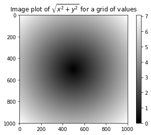
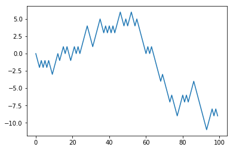

```python
# Numpy
# 用于数据整理和清理、子集构造和过滤、转换等快速的矢量化数组运算。
# 常用的数组算法，如排序、唯一化、集合运算等。
# 高效的描述统计和数据聚合/摘要运算。
# 用于异构数据集的合并/连接运算的数据对齐和关系型数据运算。
# 将条件逻辑表述为数组表达式（而不是带有if-elif-else分支的循环）。
# 数据的分组运算（聚合、转换、函数应用等）...
```


```python
# NumPy之于数值计算特别重要的原因之一，是因为它可以高效处理大数组的数据
# NumPy是在一个连续的内存块中存储数据，独立于其他Python内置对象。NumPy的C语言编写的算法库可以操作内存，而不必进行类型检查或其它前期工作。比起Python的内置序列，NumPy数组使用的内存更少。
# NumPy可以在整个数组上执行复杂的计算，而不需要Python的for循环。
```


```python
import numpy as np
```


```python
my_arr = np.arange(1000000)
```


```python
my_list = list(range(1000000))
```


```python
%time for _ in range(10): my_arr2 = my_arr * 2
```

    Wall time: 40 ms
    


```python
%time for _ in range(10): my_list2 = [x * 2 for x in my_list]
```

    Wall time: 1.7 s
    


```python
# 基于NumPy的算法要比纯Python快10到100倍（甚至更快），并且使用的内存更少。
```


```python
# NumPy的ndarray：一种多维数组对象
# NumPy最重要的一个特点就是其N维数组对象（即ndarray），该对象是一个快速而灵活的大数据集容器。你可以利用这种数组对整块数据执行一些数学运算，其语法跟标量元素之间的运算一样。
```


```python
data = np.random.randn(2, 3)  # 生成一些随机数据
```


```python
data
```


    array([[-0.2858463 ,  1.00332212,  0.24759841],
           [-0.42163321, -0.26757882, -0.22439274]])


```python
data * 10
```


    array([[-2.85846302, 10.03322119,  2.47598407],
           [-4.21633209, -2.67578816, -2.24392744]])


```python
data + data
```


    array([[-0.5716926 ,  2.00664424,  0.49519681],
           [-0.84326642, -0.53515763, -0.44878549]])


```python
# ndarray是一个通用的同构数据多维容器，也就是说，其中的所有元素必须是相同类型的。每个数组都有一个shape（一个表示各维度大小的元组）和一个dtype（一个用于说明数组数据类型的对象）
```


```python
data.shape
```


    (2, 3)


```python
data.dtype
```


    dtype('float64')


```python
# 创建ndarray
```


```python
data1 = [6, 7.5, 8, 0, 1]
```


```python
arr1 = np.array(data1)
```


```python
arr1
```


    array([6. , 7.5, 8. , 0. , 1. ])


```python
data2 = [[1, 2, 3, 4], [5, 6, 7, 8]]
```


```python
arr2 = np.array(data2)
```


```python
arr2
```


    array([[1, 2, 3, 4],
           [5, 6, 7, 8]])


```python
arr2.ndim
```


    2


```python
arr2.shape
```


    (2, 4)


```python
arr1.dtype
```


    dtype('float64')


```python
arr2.dtype
```


    dtype('int32')


```python
np.zeros(10)  # 创建指定长度或形状的全0数组
```


    array([0., 0., 0., 0., 0., 0., 0., 0., 0., 0.])


```python
np.zeros((3, 6))
```


    array([[0., 0., 0., 0., 0., 0.],
           [0., 0., 0., 0., 0., 0.],
           [0., 0., 0., 0., 0., 0.]])


```python
np.empty((2, 3, 2)) # 创建一个没有任何具体值的数组
```


    array([[[7.44656390e-312, 2.47032823e-322],
            [0.00000000e+000, 0.00000000e+000],
            [0.00000000e+000, 1.33664410e+160]],
    
           [[4.96411771e-090, 8.75703360e+169],
            [6.54878225e-043, 2.65057868e-052],
            [3.99910963e+252, 6.59785175e-042]]])


```python
np.ones((2, 3))# 创建指定长度或形状的全1数组
```


    array([[1., 1., 1.],
           [1., 1., 1.]])


```python
# ndarray的数据类型
# dtype（数据类型）是一个特殊的对象，它含有ndarray将一块内存解释为特定数据类型所需的信息
```


```python
arr1 = np.array([1, 2, 3], dtype=np.float64)
```


```python
arr2 = np.array([1, 2, 3], dtype=np.int32)
```


```python
arr1.dtype
```


    dtype('float64')


```python
arr2.dtype
```


    dtype('int32')


```python
# 可以通过ndarray的astype方法明确地将一个数组从一个dtype转换成另一个dtype
```


```python
arr = np.array([1, 2, 3, 4, 5])
```


```python
arr.dtype
```


    dtype('int32')


```python
float_arr = arr.astype(np.float64)
```


```python
float_arr.dtype
```


    dtype('float64')


```python
arr = np.array([3.7, -1.2, -2.6, 0.5, 12.9, 10.1])
```


```python
arr
```


    array([ 3.7, -1.2, -2.6,  0.5, 12.9, 10.1])


```python
arr.astype(np.int32)
```


    array([ 3, -1, -2,  0, 12, 10])


```python
numeric_strings = np.array(['1.25', '-9.6', '42'], dtype=np.string_)
```


```python
numeric_strings.astype(float)
```


    array([ 1.25, -9.6 , 42.  ])


```python
# 使用numpy.string_类型时，一定要小心，因为NumPy的字符串数据是大小固定的，发生截取时，不会发出警告。pandas提供了更多非数值数据的便利的处理方法。
```


```python
int_array = np.arange(10)
```


```python
calibers = np.array([.22, .270, .357, .380, .44, .50], dtype=np.float64)
```


```python
int_array.astype(calibers.dtype)
```


    array([0., 1., 2., 3., 4., 5., 6., 7., 8., 9.])


```python
int_array = np.arange(10)
```


```python
calibers = np.array([.22, .270, .357, .380, .44, .50], dtype=np.float64)
```


```python
int_array.astype(calibers.dtype)
```


    array([0., 1., 2., 3., 4., 5., 6., 7., 8., 9.])


```python
empty_uint32 = np.empty(8, dtype='u4')
```


```python
empty_uint32
```


    array([         0, 1075314688,          0, 1075707904,          0,
           1075838976,          0, 1072693248], dtype=uint32)


```python
# NumPy数组的运算
```


```python
# 数组很重要，因为它使你不用编写循环即可对数据执行批量运算。NumPy用户称其为矢量化（vectorization）。大小相等的数组之间的任何算术运算都会将运算应用到元素级
```


```python
arr = np.array([[1., 2., 3.], [4., 5., 6.]])
```


```python
arr
```


    array([[1., 2., 3.],
           [4., 5., 6.]])


```python
arr * arr
```


    array([[ 1.,  4.,  9.],
           [16., 25., 36.]])


```python
1 / arr  # 数组与标量的算术运算会将标量值传播到各个元素
```


    array([[1.        , 0.5       , 0.33333333],
           [0.25      , 0.2       , 0.16666667]])


```python
arr2 = np.array([[0., 4., 1.], [7., 2., 12.]])
```


```python
arr2
```


    array([[ 0.,  4.,  1.],
           [ 7.,  2., 12.]])


```python
arr2 > arr  # 大小相同的数组之间的比较会生成布尔值数组
```


    array([[False,  True, False],
           [ True, False,  True]])


```python
# 基本的索引和切片
```


```python
arr = np.arange(10)
```


```python
arr
```


    array([0, 1, 2, 3, 4, 5, 6, 7, 8, 9])


```python
arr[5]
```


    5


```python
arr[5:8]
```


    array([5, 6, 7])


```python
arr[5:8] = 12
```


```python
arr
```


    array([ 0,  1,  2,  3,  4, 12, 12, 12,  8,  9])


```python
# 将一个标量值赋值给一个切片时（如arr[5:8]=12），该值会自动传播（也就说后面将会讲到的“广播”）到整个选区。跟列表最重要的区别在于，数组切片是原始数组的视图。这意味着数据不会被复制，视图上的任何修改都会直接反映到源数组上。
```


```python
arr_slice = arr[5:8]
```


```python
arr_slice
```


    array([12, 12, 12])


```python
arr_slice[1] = 12345  # 修改arr_slice中的值，变动也会体现在原始数组arr中
```


```python
arr
```


    array([    0,     1,     2,     3,     4,    12, 12345,    12,     8,
               9])


```python
arr_slice[:] = 64  # 切片[ : ]会给数组中的所有值赋值
```


```python
arr
```


    array([ 0,  1,  2,  3,  4, 64, 64, 64,  8,  9])


```python
# 由于NumPy的设计目的是处理大数据，所以你可以想象一下，假如NumPy坚持要将数据复制来复制去的话会产生何等的性能和内存问题
```


```python
# 注意：如果你想要得到的是ndarray切片的一份副本而非视图，就需要明确地进行复制操作，例如arr[5:8].copy()。
```


```python
arr2d = np.array([[1, 2, 3], [4, 5, 6], [7, 8, 9]])
```


```python
arr2d[2]
```


    array([7, 8, 9])


```python
arr2d[0][2]
```


    3


```python
arr2d[0, 2]
```


    3


```python
# 二维数组的索引方式。轴0作为行，轴1作为列
```


```python
arr3d = np.array([[[1, 2, 3], [4, 5, 6]], [[7, 8, 9], [10, 11, 12]]])
```


```python
arr3d
```


    array([[[ 1,  2,  3],
            [ 4,  5,  6]],
    
           [[ 7,  8,  9],
            [10, 11, 12]]])


```python
arr3d[0]
```


    array([[1, 2, 3],
           [4, 5, 6]])


```python
old_values = arr3d[0].copy()
```


```python
arr3d[0] = 42
```


```python
arr3d
```


    array([[[42, 42, 42],
            [42, 42, 42]],
    
           [[ 7,  8,  9],
            [10, 11, 12]]])


```python
arr3d[0] = old_values
```


```python
arr3d
```


    array([[[ 1,  2,  3],
            [ 4,  5,  6]],
    
           [[ 7,  8,  9],
            [10, 11, 12]]])


```python
arr3d[1, 0]  # arr3d[1,0]可以访问索引以(1,0)开头的那些值（以一维数组的形式返回
```


    array([7, 8, 9])


```python
x = arr3d[1]
```


```python
x
```


    array([[ 7,  8,  9],
           [10, 11, 12]])


```python
x[0]
```


    array([7, 8, 9])


```python
# 切片索引
```


```python
arr
```


    array([ 0,  1,  2,  3,  4, 64, 64, 64,  8,  9])


```python
arr[1:6]
```


    array([ 1,  2,  3,  4, 64])


```python
arr2d
```


    array([[1, 2, 3],
           [4, 5, 6],
           [7, 8, 9]])


```python
arr2d[:2]
```


    array([[1, 2, 3],
           [4, 5, 6]])


```python
arr2d[:2, 1:]
```


    array([[2, 3],
           [5, 6]])


```python
arr2d[1, :2]
```


    array([4, 5])


```python
arr2d[:2, 2]
```


    array([3, 6])


```python
arr2d[:, :1]
```


    array([[1],
           [4],
           [7]])


```python
arr2d[:2, 1:] = 0  # 对切片表达式的赋值操作也会被扩散到整个选区
```


```python
arr2d
```


    array([[1, 0, 0],
           [4, 0, 0],
           [7, 8, 9]])


```python
# 布尔型索引
```


```python
names = np.array(['Bob', 'Joe', 'Will', 'Bob', 'Will', 'Joe', 'Joe'])
```


```python
data = np.random.randn(7, 4)
```


```python
names
```


    array(['Bob', 'Joe', 'Will', 'Bob', 'Will', 'Joe', 'Joe'], dtype='<U4')


```python
data
```


    array([[ 1.20731095,  1.05444928, -0.11724668,  0.46843526],
           [-0.3374921 , -0.15983013, -1.46555813, -0.22029146],
           [-0.1940512 , -0.78295814,  1.23358518,  0.92539382],
           [ 0.121447  , -1.23869158, -0.12735499,  0.20804702],
           [ 0.39563795, -1.02835393, -0.51960719,  0.35635621],
           [-0.52642221,  1.10541708,  0.46911533, -0.0572946 ],
           [-0.39297299,  1.15219868, -0.10600881,  0.45887964]])


```python
# 假设每个名字都对应data数组中的一行，而我们想要选出对应于名字"Bob"的所有行。
# 跟算术运算一样，数组的比较运算（如==）也是矢量化的。
# 因此，对names和字符串"Bob"的比较运算将会产生一个布尔型数组
```


```python
names == 'Bob'
```


    array([ True, False, False,  True, False, False, False])


```python
data[names == 'Bob']  # 布尔型数组的长度必须跟被索引的轴长度一致
```


    array([[ 1.20731095,  1.05444928, -0.11724668,  0.46843526],
           [ 0.121447  , -1.23869158, -0.12735499,  0.20804702]])


```python
# 可以将布尔型数组跟切片、整数（或整数序列）混合使用
```


```python
data[names == 'Bob', 2:]
```


    array([[-0.11724668,  0.46843526],
           [-0.12735499,  0.20804702]])


```python
data[names == 'Bob', 3]
```


    array([0.46843526, 0.20804702])


```python
names != 'Bob'
```


    array([False,  True,  True, False,  True,  True,  True])


```python
data[~(names == 'Bob')]  # 通过~对条件进行否定
```


    array([[-0.3374921 , -0.15983013, -1.46555813, -0.22029146],
           [-0.1940512 , -0.78295814,  1.23358518,  0.92539382],
           [ 0.39563795, -1.02835393, -0.51960719,  0.35635621],
           [-0.52642221,  1.10541708,  0.46911533, -0.0572946 ],
           [-0.39297299,  1.15219868, -0.10600881,  0.45887964]])


```python
# ~操作符用来反转条件
```


```python
cond = names == 'Bob'
```


```python
data[~cond]
```


    array([[-0.3374921 , -0.15983013, -1.46555813, -0.22029146],
           [-0.1940512 , -0.78295814,  1.23358518,  0.92539382],
           [ 0.39563795, -1.02835393, -0.51960719,  0.35635621],
           [-0.52642221,  1.10541708,  0.46911533, -0.0572946 ],
           [-0.39297299,  1.15219868, -0.10600881,  0.45887964]])


```python
mask = (names == 'Bob') | (names == 'Will')
```


```python
mask
```


    array([ True, False,  True,  True,  True, False, False])


```python
data[mask]
```


    array([[ 1.20731095,  1.05444928, -0.11724668,  0.46843526],
           [-0.1940512 , -0.78295814,  1.23358518,  0.92539382],
           [ 0.121447  , -1.23869158, -0.12735499,  0.20804702],
           [ 0.39563795, -1.02835393, -0.51960719,  0.35635621]])


```python
# Python关键字and和or在布尔型数组中无效。要是用&与|
```


```python
data[data < 0] = 0  # 将data中的所有负值都设置为0
```


```python
data
```


    array([[1.20731095, 1.05444928, 0.        , 0.46843526],
           [0.        , 0.        , 0.        , 0.        ],
           [0.        , 0.        , 1.23358518, 0.92539382],
           [0.121447  , 0.        , 0.        , 0.20804702],
           [0.39563795, 0.        , 0.        , 0.35635621],
           [0.        , 1.10541708, 0.46911533, 0.        ],
           [0.        , 1.15219868, 0.        , 0.45887964]])


```python
data[names != 'Joe'] = 7  # 通过一维布尔数组设置整行或列的值
```


```python
data
```


    array([[7.        , 7.        , 7.        , 7.        ],
           [0.        , 0.        , 0.        , 0.        ],
           [7.        , 7.        , 7.        , 7.        ],
           [7.        , 7.        , 7.        , 7.        ],
           [7.        , 7.        , 7.        , 7.        ],
           [0.        , 1.10541708, 0.46911533, 0.        ],
           [0.        , 1.15219868, 0.        , 0.45887964]])


```python
# 花式索引
```


```python
arr = np.empty((8, 4))
```


```python
for i in range(8):
    arr[i] = i
```


```python
arr
```


    array([[0., 0., 0., 0.],
           [1., 1., 1., 1.],
           [2., 2., 2., 2.],
           [3., 3., 3., 3.],
           [4., 4., 4., 4.],
           [5., 5., 5., 5.],
           [6., 6., 6., 6.],
           [7., 7., 7., 7.]])


```python
arr[[4, 3, 0, 6]]  # 为了以特定顺序选取行子集，只需传入一个用于指定顺序的整数列表或ndarray即可
```


    array([[4., 4., 4., 4.],
           [3., 3., 3., 3.],
           [0., 0., 0., 0.],
           [6., 6., 6., 6.]])


```python
# 使用负数索引将会从末尾开始选取行
arr[[-3, -5, -7]]
```


    array([[5., 5., 5., 5.],
           [3., 3., 3., 3.],
           [1., 1., 1., 1.]])


```python
# 一次传入多个索引数组返回的是一个一维数组，其中的元素对应各个索引元组
```


```python
arr = np.arange(32).reshape((8, 4))
```


```python
arr
```


    array([[ 0,  1,  2,  3],
           [ 4,  5,  6,  7],
           [ 8,  9, 10, 11],
           [12, 13, 14, 15],
           [16, 17, 18, 19],
           [20, 21, 22, 23],
           [24, 25, 26, 27],
           [28, 29, 30, 31]])


```python
arr[[1, 5, 7, 2], [0, 3, 1, 2]]
```


    array([ 4, 23, 29, 10])


```python
arr[[1, 5, 7, 2]][:, [0, 3, 1, 2]]
```


    array([[ 4,  7,  5,  6],
           [20, 23, 21, 22],
           [28, 31, 29, 30],
           [ 8, 11,  9, 10]])


```python
# 花式索引跟切片不一样，它总是将数据复制到新数组中
```


```python
# 数组转置和轴对换
```


```python
arr = np.arange(15).reshape((3, 5))
```


```python
arr
```


    array([[ 0,  1,  2,  3,  4],
           [ 5,  6,  7,  8,  9],
           [10, 11, 12, 13, 14]])


```python
arr.T  # 转置
```


    array([[ 0,  5, 10],
           [ 1,  6, 11],
           [ 2,  7, 12],
           [ 3,  8, 13],
           [ 4,  9, 14]])


```python
arr = np.random.randn(6, 3)
```


```python
arr
```


    array([[-1.6100647 , -0.28307001,  1.31805657],
           [-0.20725088, -0.68228715,  0.54683313],
           [ 0.20505813, -0.90467427, -0.5176926 ],
           [-0.63477262,  0.86012831, -1.72080872],
           [ 1.8031595 ,  1.01178055, -0.61343824],
           [ 0.15304263, -0.43608959,  0.40960023]])


```python
np.dot(arr.T, arr)  # 计算矩阵内积
```


    array([[ 6.3550526 ,  1.62333035, -2.29276352],
           [ 1.62333035,  3.31777465, -2.55725991],
           [-2.29276352, -2.55725991,  5.8095667 ]])


```python
arr = np.arange(16).reshape((2, 2, 4))
```


```python
arr
```


    array([[[ 0,  1,  2,  3],
            [ 4,  5,  6,  7]],
    
           [[ 8,  9, 10, 11],
            [12, 13, 14, 15]]])


```python
arr.transpose((1, 0, 2))  # 第一个轴被换成了第二个，第二个轴被换成了第一个，最后一个轴不变
```


    array([[[ 0,  1,  2,  3],
            [ 8,  9, 10, 11]],
    
           [[ 4,  5,  6,  7],
            [12, 13, 14, 15]]])


```python
arr
```


    array([[[ 0,  1,  2,  3],
            [ 4,  5,  6,  7]],
    
           [[ 8,  9, 10, 11],
            [12, 13, 14, 15]]])


```python
arr.swapaxes(1, 2) 
```


    array([[[ 0,  4],
            [ 1,  5],
            [ 2,  6],
            [ 3,  7]],
    
           [[ 8, 12],
            [ 9, 13],
            [10, 14],
            [11, 15]]])


```python
# 通用函数：快速的元素级数组函数
```


```python
# 通用函数（即ufunc）是一种对ndarray中的数据执行元素级运算的函数。
# 你可以将其看做简单函数（接受一个或多个标量值，并产生一个或多个标量值）的矢量化包装器。
```


```python
arr = np.arange(10)
```


```python
arr
```


    array([0, 1, 2, 3, 4, 5, 6, 7, 8, 9])


```python
np.sqrt(arr)
```


    array([0.        , 1.        , 1.41421356, 1.73205081, 2.        ,
           2.23606798, 2.44948974, 2.64575131, 2.82842712, 3.        ])


```python
np.exp(arr)
```


    array([1.00000000e+00, 2.71828183e+00, 7.38905610e+00, 2.00855369e+01,
           5.45981500e+01, 1.48413159e+02, 4.03428793e+02, 1.09663316e+03,
           2.98095799e+03, 8.10308393e+03])


```python
x = np.random.randn(8)
```


```python
y = np.random.randn(8)
```


```python
x
```


    array([ 0.37185144,  2.43858872, -0.19016059, -0.51166304, -0.1586498 ,
            0.03519861, -1.66912932,  1.96548483])


```python
y
```


    array([ 0.08313875,  0.08148846,  0.79261074,  1.19846794,  0.68395702,
            1.16771799, -1.86538887,  1.23833462])


```python
np.maximum(x, y)
```


    array([ 0.37185144,  2.43858872,  0.79261074,  1.19846794,  0.68395702,
            1.16771799, -1.66912932,  1.96548483])


```python
arr = np.random.randn(7) * 5
```


```python
arr
```


    array([ 2.67837581, -6.79317904, -4.36115285,  2.92045311,  7.99414674,
           -3.03727923,  5.32753636])


```python
remainder, whole_part = np.modf(arr)
```


```python
remainder  # 小数部分
```


    array([ 0.67837581, -0.79317904, -0.36115285,  0.92045311,  0.99414674,
           -0.03727923,  0.32753636])


```python
whole_part  # 整数部分
```


    array([ 2., -6., -4.,  2.,  7., -3.,  5.])


```python
arr
```


    array([ 2.67837581, -6.79317904, -4.36115285,  2.92045311,  7.99414674,
           -3.03727923,  5.32753636])


```python
np.sqrt(arr)
```

    c:\program files\python36\lib\site-packages\ipykernel_launcher.py:1: RuntimeWarning: invalid value encountered in sqrt
      """Entry point for launching an IPython kernel.
    


    array([1.63657441,        nan,        nan, 1.70893333, 2.82739221,
                  nan, 2.30814565])


```python
np.sqrt(arr, arr)
```

    c:\program files\python36\lib\site-packages\ipykernel_launcher.py:1: RuntimeWarning: invalid value encountered in sqrt
      """Entry point for launching an IPython kernel.
    


    array([1.63657441,        nan,        nan, 1.70893333, 2.82739221,
                  nan, 2.30814565])


```python
# 利用数组进行数据处理
```


```python
points = np.arange(-5, 5, 0.01)
```


```python
xs, ys = np.meshgrid(points, points)
```


```python
ys
```


    array([[-5.  , -5.  , -5.  , ..., -5.  , -5.  , -5.  ],
           [-4.99, -4.99, -4.99, ..., -4.99, -4.99, -4.99],
           [-4.98, -4.98, -4.98, ..., -4.98, -4.98, -4.98],
           ...,
           [ 4.97,  4.97,  4.97, ...,  4.97,  4.97,  4.97],
           [ 4.98,  4.98,  4.98, ...,  4.98,  4.98,  4.98],
           [ 4.99,  4.99,  4.99, ...,  4.99,  4.99,  4.99]])


```python
z = np.sqrt(xs ** 2 + ys ** 2)
```


```python
z
```


    array([[7.07106781, 7.06400028, 7.05693985, ..., 7.04988652, 7.05693985,
            7.06400028],
           [7.06400028, 7.05692568, 7.04985815, ..., 7.04279774, 7.04985815,
            7.05692568],
           [7.05693985, 7.04985815, 7.04278354, ..., 7.03571603, 7.04278354,
            7.04985815],
           ...,
           [7.04988652, 7.04279774, 7.03571603, ..., 7.0286414 , 7.03571603,
            7.04279774],
           [7.05693985, 7.04985815, 7.04278354, ..., 7.03571603, 7.04278354,
            7.04985815],
           [7.06400028, 7.05692568, 7.04985815, ..., 7.04279774, 7.04985815,
            7.05692568]])


```python
import matplotlib.pyplot as plt
```


```python
plt.imshow(z, cmap=plt.cm.gray)
plt.colorbar()
plt.title('Image plot of $\sqrt{x^2 + y^2}$ for a grid of values')
```


    Text(0.5,1,'Image plot of $\\sqrt{x^2 + y^2}$ for a grid of values')





```python
# 将条件逻辑表述为数组运算
```


```python
xarr = np.array([1.1, 1.2, 1.3, 1.4, 1.5])
```


```python
yarr = np.array([2.1, 2.2, 2.3, 2.4, 2.5])
```


```python
cond = np.array([True, False, True, True, False])
```


```python
result = [(x if c else y) for x, y, c in zip(xarr, yarr, cond)]
```


```python
result
```


    [1.1, 2.2, 1.3, 1.4, 2.5]


```python
# np.where的第二个和第三个参数不必是数组，它们都可以是标量值。在数据分析工作中，where通常用于根据另一个数组而产生一个新的数组。
result = np.where(cond, xarr, yarr) 
```


```python
result
```


    array([1.1, 2.2, 1.3, 1.4, 2.5])


```python
arr = np.random.randn(4, 4)
```


```python
arr
```


    array([[ 0.10834452,  0.73598322,  0.18594446, -0.53543514],
           [-0.68116518, -2.36311518,  0.47696734, -0.25721681],
           [-2.59991254,  0.62337648,  0.13880521,  0.65151267],
           [-0.04621611, -0.59183733,  0.30250912,  0.21975363]])


```python
arr > 0
```


    array([[ True,  True,  True, False],
           [False, False,  True, False],
           [False,  True,  True,  True],
           [False, False,  True,  True]])


```python
np.where(arr > 0, 2, -2)  # 正值替换为 2, 负值替换为 -2
```


    array([[ 2,  2,  2, -2],
           [-2, -2,  2, -2],
           [-2,  2,  2,  2],
           [-2, -2,  2,  2]])


```python
np.where(arr > 0, 2, arr)  # 正值替换为 2
```


    array([[ 2.        ,  2.        ,  2.        , -0.53543514],
           [-0.68116518, -2.36311518,  2.        , -0.25721681],
           [-2.59991254,  2.        ,  2.        ,  2.        ],
           [-0.04621611, -0.59183733,  2.        ,  2.        ]])


```python
# 数学和统计方法
```


```python
arr = np.random.randn(5, 4)
```


```python
arr
```


    array([[ 0.5193418 , -0.17108936, -1.1383029 ,  0.69515273],
           [ 0.09061048, -0.54660196, -0.54152058,  0.19564715],
           [ 0.49714748,  0.20781684, -0.89795086, -0.27861876],
           [-2.59081552, -2.15780337, -0.60762641,  0.90569674],
           [-0.73465247, -0.90230141,  1.21949612, -1.48803138]])


```python
arr.mean()
```


    -0.38622028132178515


```python
np.mean(arr)
```


    -0.38622028132178515


```python
arr.sum()
```


    -7.724405626435703


```python
arr.mean(axis=1)  # 计算该轴向上的统计值，最终结果是一个少一维的数组
```


    array([-0.02372443, -0.20046623, -0.11790133, -1.11263714, -0.47637228])


```python
arr.sum(axis=0)
```


    array([-2.21836823, -3.56997926, -1.96590462,  0.02984649])


```python
arr = np.array([0, 1, 2, 3, 4, 5, 6, 7])
```


```python
arr.cumsum()  # 累加函数 产生一个由中间结果组成的数组
```


    array([ 0,  1,  3,  6, 10, 15, 21, 28], dtype=int32)


```python
arr = np.array([[0, 1, 2], [3, 4, 5], [6, 7, 8]])
```


```python
arr
```


    array([[0, 1, 2],
           [3, 4, 5],
           [6, 7, 8]])


```python
arr.cumsum(axis=0)  # 累计和
```


    array([[ 0,  1,  2],
           [ 3,  5,  7],
           [ 9, 12, 15]], dtype=int32)


```python
arr.cumprod(axis=1)  # 累计积
```


    array([[  0,   0,   0],
           [  3,  12,  60],
           [  6,  42, 336]], dtype=int32)


```python
# 基本数组统计方法
# sum      对数组中全部或某轴向的元素求和. 零长度的数组的sum为0
# mean     算术平均数 零长度的数组的mean为NaN
# std,var  分别为标准差和方差, 自由度可调
# min,max  最大值和最小值
# argmin,argmax  分别为最大和最小元素的索引
# cumsum   所有元素的累计和
# cumprod  所有元素的累计积
```


```python
# 用于布尔型数组的方法
```


```python
arr = np.random.randn(100)
```


```python
(arr > 0).sum()  # 正值个数
```


    47


```python
bools = np.array([False, False, True, False])
```


```python
bools.any()  # 是否存在一个或多个True
```


    True


```python
bools.all()  # 所有值是否都为True
```


    False


```python
# 排序
```


```python
arr = np.random.randn(6)
```


```python
arr
```


    array([-0.23171277, -1.13207472, -0.30703283,  1.55126671, -0.13228057,
           -0.95029111])


```python
arr.sort()
```


```python
arr
```


    array([-1.13207472, -0.95029111, -0.30703283, -0.23171277, -0.13228057,
            1.55126671])


```python
arr = np.random.randn(5, 3)
```


```python
arr
```


    array([[-1.37278173,  0.7785353 ,  0.03022999],
           [-0.56881066, -0.30175941,  0.42988781],
           [ 0.0280206 , -0.31675738,  0.39006162],
           [ 0.0764617 , -0.35076194,  0.2466772 ],
           [-0.0534165 ,  0.03117598, -2.15484335]])


```python
arr.sort(1)
```


```python
arr
```


    array([[-1.37278173,  0.03022999,  0.7785353 ],
           [-0.56881066, -0.30175941,  0.42988781],
           [-0.31675738,  0.0280206 ,  0.39006162],
           [-0.35076194,  0.0764617 ,  0.2466772 ],
           [-2.15484335, -0.0534165 ,  0.03117598]])


```python
large_arr = np.random.randn(1000)
```


```python
large_arr.sort()  # 就地排序 修改数组本身 (np.sort(arr) 返回排序后副本 )
```


```python
large_arr[int(0.05 * len(large_arr))]  # 5%
```


    -1.578309516644319


```python
# 唯一化以及其他的集合逻辑
```


```python
names = np.array(['Bob', 'Joe', 'Will', 'Bob', 'Will', 'Joe', 'Joe'])
```


```python
np.unique(names)
```


    array(['Bob', 'Joe', 'Will'], dtype='<U4')


```python
ints = np.array([3, 3, 3, 2, 2, 1, 1, 4, 4])
```


```python
np.unique(ints)
```


    array([1, 2, 3, 4])


```python
sorted(set(names))
```


    ['Bob', 'Joe', 'Will']


```python
values = np.array([6, 0, 0, 3, 2, 5, 6])
```


```python
np.in1d(values, [2, 3, 6])  # 一个数组中的值在另一个数组中的成员资格
```


    array([ True, False, False,  True,  True, False,  True])


```python
# 数组的集合运算
# unique(x)  计算x中的唯一元素, 并返回有序结果
# intersect1d(x, y)  计算x和y的交集, 并返回有序结果
# union1d(x, y)  计算x和y的并集, 并返回有序结果
# in1d(x, y)  返回一个表示"x的元素是否包含于y"的布尔型数组
# setdiff1d(x, y)  集合的差 元素在x中且不在y中
# setxor1d(x, y)  集合的对称差 即存在于一个数组中但不同时存在于两个数组中的元素
```


```python
# 用于数组的文件输入输出
```


```python
arr = np.arange(10)
```


```python
np.save('some_array', arr)
```


```python
np.load('some_array.npy')
```


    array([0, 1, 2, 3, 4, 5, 6, 7, 8, 9])


```python
np.savez('array_archive.npz', a=arr, b=arr)
```


```python
arch = np.load('array_archive.npz')
```


```python
arch['b']
```


    array([0, 1, 2, 3, 4, 5, 6, 7, 8, 9])


```python
np.savez_compressed('arrays_compressed.npz', a=arr, b=arr)
```


```python
# 线性代数
```


```python
x = np.array([[1., 2., 3.], [4., 5., 6.]])
```


```python
y = np.array([[6., 23.], [-1, 7], [8, 9]])
```


```python
x
```


    array([[1., 2., 3.],
           [4., 5., 6.]])


```python
y
```


    array([[ 6., 23.],
           [-1.,  7.],
           [ 8.,  9.]])


```python
x.dot(y)
```


    array([[ 28.,  64.],
           [ 67., 181.]])


```python
np.dot(x, y)
```


    array([[ 28.,  64.],
           [ 67., 181.]])


```python
np.dot(x, np.ones(3))
```


    array([ 6., 15.])


```python
x @ np.ones(3)  # @中缀运算符
```


    array([ 6., 15.])


```python
from numpy.linalg import inv, qr
```


```python
X = np.random.randn(5, 5)
```


```python
mat = X.T.dot(X)
```


```python
inv(mat)
```


    array([[ 1.55471511,  0.44822561, -1.4510195 , -0.39496251, -0.17108193],
           [ 0.44822561,  1.64152383, -4.21762014, -1.52254097,  1.1289603 ],
           [-1.4510195 , -4.21762014, 21.1242369 ,  7.76721135, -5.59074558],
           [-0.39496251, -1.52254097,  7.76721135,  3.10443186, -2.03813093],
           [-0.17108193,  1.1289603 , -5.59074558, -2.03813093,  1.93939991]])


```python
mat.dot(inv(mat))
```


    array([[ 1.00000000e+00,  5.22851175e-16, -5.66130724e-15,
            -3.21474602e-16,  6.59467958e-16],
           [ 6.90490033e-17,  1.00000000e+00, -6.40003956e-16,
            -1.48480600e-17,  1.26008000e-16],
           [-6.76665056e-17, -5.11506070e-16,  1.00000000e+00,
             1.57983847e-15, -1.17636879e-15],
           [ 1.34210434e-16,  2.41409894e-16, -2.60988702e-15,
             1.00000000e+00,  3.57791340e-16],
           [-1.63220242e-16,  5.26514279e-16, -1.03343187e-15,
            -1.74667402e-16,  1.00000000e+00]])


```python
q, r = qr(mat)
```


```python
r
```


    array([[-2.78866216,  0.55874596, -2.83503445,  3.71490587, -5.19092029],
           [ 0.        , -1.29835872, -0.64299733,  0.94409168, -0.09726619],
           [ 0.        ,  0.        , -1.32749972,  3.59814696,  0.02471002],
           [ 0.        ,  0.        ,  0.        , -1.06088793, -1.45090984],
           [ 0.        ,  0.        ,  0.        ,  0.        ,  0.15718238]])


```python
# 常用的numpy.linalg函数
# diag  以一维数组的形式返回方针的对角线元素, 或将一维数组转换为方阵
# dot  矩阵乘法
# trace  计算对角线元素和
# det  计算矩阵行列式
# eig  计算方阵的本征值和本征向量
# inv  计算方阵的逆
# pinv  计算矩阵的Moore-Perose伪逆
# qr  计算QR分解
# svd  计算奇异值分解(SVD)
# solve  解线性方程Ax=b 其中A为一个方阵
# lstsq  计算Ax=b的最小二乘解
```


```python
# 伪随机数生成
```


```python
# numpy.random模块对Python内置的random进行了补充，增加了一些用于高效生成多种概率分布的样本值的函数。
```


```python
samples = np.random.normal(size=(4, 4))
```


```python
samples
```


    array([[-0.2082936 ,  0.62951559,  1.06941816, -1.84921528],
           [-0.41923381,  0.01562553, -1.19150016,  1.68480063],
           [-2.13967036, -0.3951192 , -0.01744141,  1.98163724],
           [-0.74364112,  1.28977155,  0.02978065, -1.10120257]])


```python
from random import normalvariate
```


```python
N = 1000000
```


```python
%timeit sammples = [normalvariate(0, 1) for _ in range(N)]
```

    1.47 s ± 88.5 ms per loop (mean ± std. dev. of 7 runs, 1 loop each)
    


```python
%timeit np.random.normal(size=N)
```

    44.8 ms ± 1.26 ms per loop (mean ± std. dev. of 7 runs, 10 loops each)
    


```python
np.random.seed(1234)
```


```python
rng = np.random.RandomState(1234)  # 创建一个与其它隔离的随机数生成器
```


```python
rng.randn(10)
```


    array([ 0.47143516, -1.19097569,  1.43270697, -0.3126519 , -0.72058873,
            0.88716294,  0.85958841, -0.6365235 ,  0.01569637, -2.24268495])


```python
# seed  确定随机数生成器的种子
# permutation  返回一个序列的随机排列或返回一个随机排列的范围
# shuffe  对一个序列就地随机排列
# rand  产生均匀分布的样本值
# randint  从给定的上下限范围内随机选取整数
# randn  产生正态分布的样本值, 类似于MATPLAB接口
# binomial  产生二项分布的样本值
# normal  产生正态(高斯)分布的样本值
# beta  产生Beta分布的样本值
# chisquare  产生卡片分布的样本值
# gamma  产生Gamma分布的样本值
# uniform  产生[0, 1)中均匀分布的样本值
```


```python
# 示例 - 随机漫步
```


```python
import random
position = 0
walk = [position]
steps = 1000
for i in range(steps):
    step = 1 if random.randint(0, 1) else -1
    position += step
    walk.append(position)
```


```python
plt.plot(walk[:100])
```


    [<matplotlib.lines.Line2D at 0x15e81699c88>]





```python
nsteps = 1000
```


```python
draws = np.random.randint(0, 2, size=nsteps)
```


```python
setps = np.where(draws > 0, 1, -1)
```


```python
walk = setps.cumsum()
```


```python
walk.min()
```


    -9


```python
walk.max()
```


    60


```python
(np.abs(walk) >= 10).argmax()
```


    297


```python
# 一次模拟多个随机漫步
```


```python
nwalks = 5000
```


```python
nsteps = 1000
```


```python
draws = np.random.randint(0, 2, size=(nwalks, nsteps))  # 0 or 1
```


```python
steps = np.where(draws > 0, 1, -1)
```


```python
walks = steps.cumsum(1)
```


```python
walks
```


    array([[  1,   2,   3, ...,  46,  47,  46],
           [  1,   0,   1, ...,  40,  41,  42],
           [  1,   2,   3, ..., -26, -27, -28],
           ...,
           [  1,   0,   1, ...,  64,  65,  66],
           [  1,   2,   1, ...,   2,   1,   0],
           [ -1,  -2,  -3, ...,  32,  33,  34]], dtype=int32)


```python
walks.max()
```


    122


```python
walks.min()
```


    -128


```python
hits30 = (np.abs(walks) >= 30).any(1)
```


```python
hits30
```


    array([ True,  True,  True, ...,  True, False,  True])


```python
hits30.sum()
```


    3368


```python
crossing_times = (np.abs(walks[hits30]) >= 30).argmax(1)
```


```python
crossing_times.mean()
```


    509.99762470308787


```python
steps = np.random.normal(loc=0, scale=0.25, size=(nwalks, nsteps))
```
